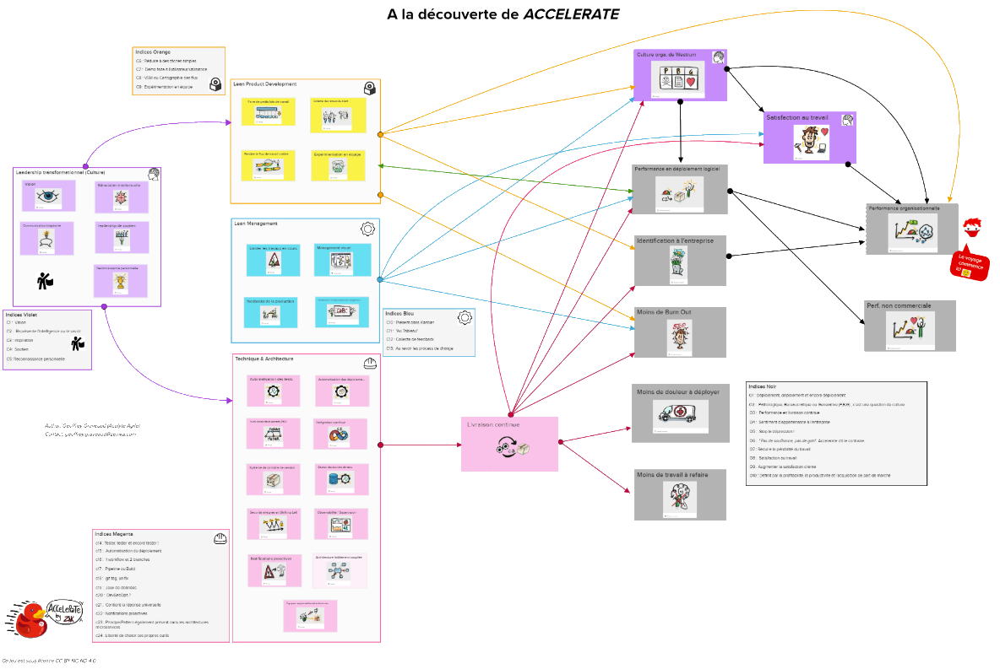

:icons: font
:revealjs_transition: fade
:revealjs_progress: true
:revealjs_previewLinks: true
:revealjs_mouseWheel: true
:revealjs_history: true
:revealjs_preloadIframes: true
:revealjs_previewLinks: true
:revealjs_showNotes: false
:customcss: custom.css
:source-highlighter: highlightjs
:kroki-default-format: svg

:docinfo:

[%notitle]
= Accelerate
:sectnums!:

[NOTE.speaker]
--
--

[%notitle]
== Générique

"Nous déclarons que la splendeur du monde s'est enrichie d'une beauté nouvelle: la beauté de la vitesse. Une
automobile de course avec son coffre orné de gros tuyaux, tels des serpents à l'haleine explosive... une automobile
rugissante, qui a l'air de courir sur de la mitraille, est plus belle que la Victoire de Samothrace."
-- Filippo Tommaso Marinetti, Manifeste du futurisme - 1909

[NOTE.speaker]
--
Voir notament https://pierre-lamble2.eu/resources/Expos%C3%A9s_BTS/Manifeste%20du%20Futurisme.pdf[l'article du Figaro]
--

[%notitle, background-iframe="https://monzo.com/blog/2022/05/16/how-we-deploy-to-production-over-100-times-a-day"]
== Un exemple d'exploitation des résultats d'Accelerate

[%notitle]
== Qui suis-je ?

Nicolas Delsaux / @riduidel on https://twitter.com/riduidel[icon:twitter[]] / https://github.com/riduidel[icon:github[]] / https://stackexchange.com/users/8620[icon:stack-overflow[]]

Développeur Java depuis l'an 2000

Architecte de solutions/systèmes depuis 2015

image::images/zenika.png[height=100]

[NOTE.speaker]
--
Insister sur le fait que je présente avec Sébastien des ateliers d'acculturation chez Decathlon
--

[%notitle]
== Accelerate, c'est quoi ?

https://cloud.google.com/blog/products/devops-sre/announcing-dora-2021-accelerate-state-of-devops-report[image:images/state_of_devops_2021.png[height=400]]
https://www.amazon.fr/Accelerate-Building-Performing-Technology-Organizations/dp/1942788339[image:images/accelerate_book.jpg[height=400]]

[NOTE.speaker]
--
State of DevOps est une étude annuelle sur les pratiques des ingénieurs DevOps.
Elle se focalisait initialement sur les questions de livraison de code avant de s'étendre à d'autres pratiques dont l'impact a été découvert grâce à l'étude.

Accelerate est un livre écrit par Nicole Forsgren dans lequel, grâce à des outils statistiques, elle remplace les corrélations observées dans State of DevOps par des liens de causalité grâce à des méthodes statistiques (chi², analyse en composantes principales, clusterisation, ...).

**CA N'EST PAS UN FRAMEWORK D'ORGANISATION**
--

[%notitle]
=== Mais aussi

image::images/accelerate_capabilities.png[]

[NOTE.speaker]
--
L'élément le plus marketé du livre est ce graphique mettant en lumière les capacités et leur impact sur certains objectifs d'organisations.
--

[%notitle]
=== En atelier chez Zenika

[NOTE.speaker]
--
On organise pour nos clients des ateliers de sensibilisation à Accelerate dans lesquels on leur fait découvrir, 
grâce à une approche gamifiée, les différents objectifs et capacités.
C'est un atelier qui est un peu long pour ce matin - il prendrait tout le reste de la matinée - donc on va en faire une version résumée, sans pour autant en perdre les éléments essentiels
--

[%notitle]
== Sous une autre forme

[pikchr, capabilities_introduction, svg, opts="inline", role=svg]
----
include::capabilities_introduction.pikchr[]
----

[NOTE.speaker]
--
Reprenons donc notre fameux schéma.
Qu'est-ce qui est le plus important pour une organisation ?
--

[%notitle]
== C'est quoi la performance organisationnelle ?

[pikchr, capabilities_introduction, svg, opts=inline, role=svg]
----
include::capabilities_goal_perf_orga.pikchr[]
----

[NOTE.speaker]
--
C'est évidement d'atteindre le niveau approprié de performance organisationnelle.
Mais c'est quoi ?
--

[%notitle, background-iframe="https://fr.wikipedia.org/wiki/Gestion_de_la_performance_organisationnelle"]
=== Petit moment de déifnition

[NOTE.speaker]
--
Une vision simple de la performance organisationnelle, c'est que l'organisation réussit à atteindre ses objectifs.
Et je ne parle pas là directement d'objectifs financiers.
Parce que je vous le rappelle, une entreprise n'a pas pour unique but de gagner de l'argent.
En fait, une entreprise fait circuler de l'argent afin d'atteindre la mission qu'elle s'est fixée (sinon toutes les entreprises feraient du trading haute fréquence, car c'est la façon la plus efficace de produire de l'argent à partir de ... rien, en fait)
--

[%notitle]
=== C'est quoi la performance organisationnelle ? - transition

[pikchr, capabilities_introduction, svg, opts=inline, role=svg]
----
include::capabilities_goal_perf_orga.pikchr[]
----

[NOTE.speaker]
--
Comme Zenika se sépcialise dans le conseil en IT, évidement, 
on va s'intéresser à la performance déclinée au domaine de la production de code.
--

[%notitle]
=== Comment ça se passe quand l'organisation produit du logiciel? Introduction

[pikchr, capabilities_introduction, svg, opts=inline, role=svg]
----
include::capabilities_goal_perf_technique.pikchr[]
----

[NOTE.speaker]
--
Si on travaille dans le monde du logiciel, on peut traduire cette performance de tout un tas de façons intéressantes
(nombre de lignes de codes produites, nombre de features livrées, ...).
Ce qu'écrit Accelerate, et qu'on retrouve https://cloud.google.com/blog/products/devops-sre/using-the-four-keys-to-measure-your-devops-performance[sur le site du DORA], est que, si on prend un point de vue DevOps sur la production de logicielle, on peut réduire cette peformance à quelques indicateurs simples (qui sont ceux de l'assessment passé).
--

[%notitle]
=== Comment ça se passe quand l'organisation produit du logiciel? Métriques

image::images/accelerate_key_metrics.jpg[background, size=cover]

[NOTE.speaker]
--
Deux paires d emétriques relatives à deux aspects clé d'Accelerate

* Livrer rapidement
** Fréquence de déploiement
** Temps de déploiement d'un changement
* Du code de qualité
** Temps de restauration du service
** Taux de déploiements introduisant des indisponibilités
--

[%notitle]
=== Comment ça se passe quand l'organisation produit du logiciel? Conclusion

[pikchr, capabilities_introduction, svg, opts=inline, role=svg]
----
include::capabilities_goal_perf_technique.pikchr[]
----

[NOTE.speaker]
--
On voit donc qu'on peut évaluer de façon simple la capacité d'une organisation à produire rapidement du code de qualité.
Mais qu'est-ce qui permet d'atteindre ce haut niveau de qualité ?
--

[.columns]
[%notitle]
== Comment atteindre un haut niveau de performance ?

[.column]
[%step]
image::https://s3-us-west-2.amazonaws.com/usedphotosna/85119831_614.jpg[height=550]

[.column]
[%step]
image::https://www.spinsheet.com/images/articles/AC210310cb_22014.jpg[height=550]

[NOTE.speaker]
--
Quand j'étais jeune, je pratiquais la voile sportive.
J'ai en particulier quelques bons résultats en laser (*STEP* le dériveur que vous voyez sur la gauche de l'image).

Et j'ai appris à ce moment quelqu chose d'important : dire à quelqu'un "demain, tu gagnes la course", ça ne sert à rien.
Autrement dit, mesurer ces métriques est très bien, 
parce que ça permet de distinguer les organisations capables d'atteindre un haut niveau de performance.
Mais ça ne permet pas de progresser ves ces objectifs.

*STEP* *DEMANDER AU PUBLIC*
Qu'est-ce qui permet donc de passer de ce petit dériveur à la coupe de l'america ?

Un autre apprentissage de la voile est que, pour passer devant quelqu'un d'autre, il faut forcément prendre un autre chemin ...
--

[%notitle, background-iframe="https://fr.wikipedia.org/wiki/Roue_de_Deming"]
=== Parenthèse qualité - roue de Deming

[%notitle, background-iframe="https://fr.wikipedia.org/wiki/Boucle_OODA"]
=== Parenthèse OODA - Version simple

[NOTE.speaker]
--
--

[%notitle]
=== Parenthèse OODA - Version complète

[pikchr, ooda_full, svg, opts=inline, role=svg]
----
include::ooda_full.pikchr[]
----

=== https://cloud.google.com/architecture/devops/devops-culture-transformational-leadership[Implicit guidance and control]

* Vision
* Communication inspirante
* Stimulation intellectuelle
* Leadership de soutien

=== 👀 Observe

[unstyled]
* 📝 https://cloud.google.com/architecture/devops/devops-process-customer-feedback[Collecte des retours utilisateurs]
* 🖥️ https://cloud.google.com/architecture/devops/devops-measurement-monitoring-systems[Collecte des retours de la production]
* ⚒️ https://cloud.google.com/architecture/devops/devops-measurement-monitoring-and-observability[Monitoring/observabilité]
* ⚒️ https://cloud.google.com/architecture/devops/devops-measurement-proactive-failure-notification[Notifications proactives]
* ⚒️ https://cloud.google.com/architecture/devops/devops-tech-shifting-left-on-security[Sécurité intégrée en amont]
* ⚒️ https://cloud.google.com/architecture/devops/devops-tech-test-data-management[Gestion des données de test]

[.columns]
=== 🧭 Orient

[.column]
[unstyled]
* 📝 https://cloud.google.com/architecture/devops/devops-process-team-experimentation[Expérimentation en équipe]

[.column]
[unstyled]
* 🖥️ https://cloud.google.com/architecture/devops/devops-measurement-wip-limits[Limiter les travaux en cours]
* 📝 https://cloud.google.com/architecture/devops/devops-process-working-in-small-batches[Travailler par petits lots]
* ⚒️ https://cloud.google.com/architecture/devops/devops-tech-trunk-based-development[Développement à branche unique]

[.column]
[unstyled]
* ⚒️ https://cloud.google.com/architecture/devops/devops-tech-architecture[Architecture faiblement couplée]
* ⚒️ https://cloud.google.com/architecture/devops/devops-tech-teams-empowered-to-choose-tools[Equipes responsables et autonomes]

=== 🧑‍⚖️ Decide

[unstyled]
* 📝 https://cloud.google.com/architecture/devops/devops-process-work-visibility-in-value-stream[Flux de travail visible]
* 🖥️ https://cloud.google.com/architecture/devops/devops-measurement-visual-management[Management visuel]
* 🖥️ https://cloud.google.com/architecture/devops/devops-process-streamlining-change-approval[Simplification de l'approbation des changements]

[.columns]
=== 🦾 Act

[.column]
[unstyled]
* ⚒️ https://cloud.google.com/architecture/devops/devops-tech-version-control[Contrôle de version]
* ⚒️ https://cloud.google.com/architecture/devops/devops-tech-continuous-integration[Intégration continue]
* ⚒️ https://cloud.google.com/architecture/devops/devops-tech-test-automation[Tests continus]
* ⚒️ https://cloud.google.com/architecture/devops/devops-tech-deployment-automation[Automatisation des déploiements]

[%notitle]
== Quels bénéfices ?

[pikchr, capabilities_introduction, svg, opts=inline, role=svg]
----
include::capabilities_goal_cd.pikchr[]
----

[%notitle]
== Quels bénéfices additionnels ? Moins de travail à refaire

[pikchr, capabilities_introduction, svg, opts=inline, role=svg]
----
include::capabilities_goal_rework.pikchr[]
----

[%notitle]
== Quels bénéfices additionnels ? Moins de douleur à déployer

[pikchr, capabilities_introduction, svg, opts=inline, role=svg]
----
include::capabilities_goal_deploy.pikchr[]
----

[%notitle]
== Quels bénéfices additionnels ? Moins de burn-out

[pikchr, capabilities_introduction, svg, opts=inline, role=svg]
----
include::capabilities_goal_burnout.pikchr[]
----

[%notitle]
== Quels bénéfices additionnels ? Identification à l'entreprise

[pikchr, capabilities_introduction, svg, opts=inline, role=svg]
----
include::capabilities_goal_identification.pikchr[]
----

[%notitle]
== Quels bénéfices additionnels ? Culture organisationnelle de Westrum

[pikchr, capabilities_introduction, svg, opts=inline, role=svg]
----
include::capabilities_goal_westrum.pikchr[]
----

[%notitle]
== Quels bénéfices additionnels ? Culture organisationnelle de Westrum - détails

[options=header, frame=none, role=westrum]
|===
||*Pathologique* |*Bureaucratique* |*Générative*
|Orientée|pouvoir|règlement|performance
|Cooperation|faible|modeste|élevée
|Messagers|abattus|négligés|entrainées
|Responsabilités|évitées|restreintes|partagées
|Efforts transverses|découragés|tolérés|encouragés
|Echec|Chasse aux sorcières|Justice|Enquête
|Innovation|annihilée|entraîne des problèmes|Implémentée
|===

[NOTE.speaker]
--
Ce tableau provient de https://qualitysafety.bmj.com/content/qhc/13/suppl_2/ii22.full.pdf[A typology of organisational cultures - R Westrum]
--

[%notitle]
== Quels bénéfices additionnels ? Satisfaction au travail

[pikchr, capabilities_introduction, svg, opts=inline, role=svg]
----
include::capabilities_goal_satisfaction.pikchr[]
----

[%notitle]
== Quels bénéfices additionnels ? Performance non-commerciale

[pikchr, capabilities_introduction, svg, opts=inline, role=svg]
----
include::capabilities_goal_image.pikchr[]
----

== Conclusion

=== Accélérer ? Jusqu'à quelle vitesse

=== Comment rendre compatible le green-it et les résultats d'Accelerate ?