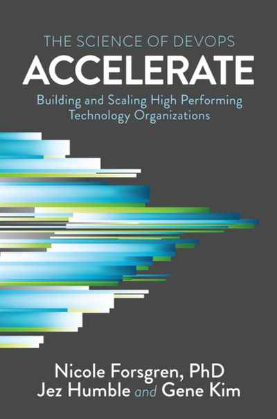
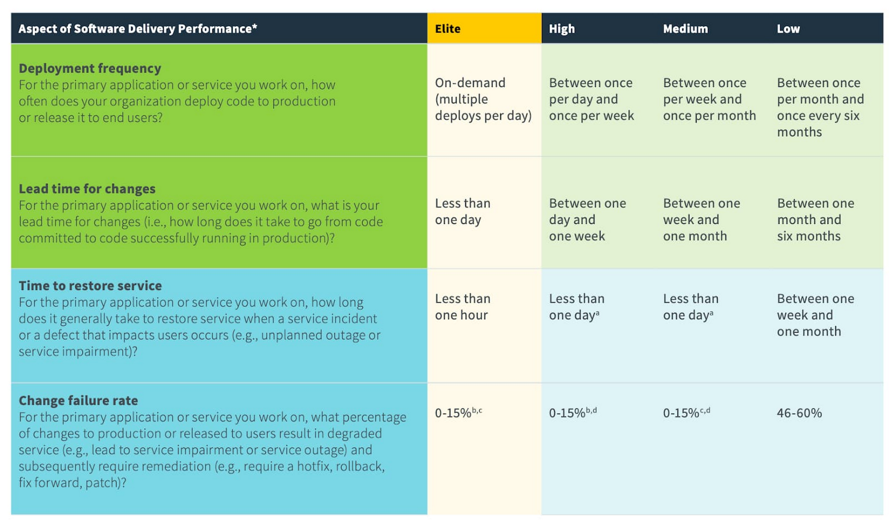

:icons: font
:revealjs_progress: true
:revealjs_previewLinks: true
:revealjs_mouseWheel: true
:revealjs_history: true
:revealjs_preloadIframes: true
:revealjs_plugin_notes: disabled
:revealjs_plugins: {slidesdir}/plugins.js
:revealjs_plugins_configuration: {slidesdir}/configs.js
:customcss: custom.css
:source-highlighter: highlightjs
:kroki-default-format: svg

[%notitle]
= Accelerate
:sectnums!:

[NOTE.speaker]
--
--

[%notitle]
== Générique

"Nous déclarons que la splendeur du monde s'est enrichie d'une beauté nouvelle: la beauté de la vitesse. Une
automobile de course avec son coffre orné de gros tuyaux, tels des serpents à l'haleine explosive... une automobile
rugissante, qui a l'air de courir sur de la mitraille, est plus belle que la Victoire de Samothrace."
-- Filippo Tommaso Marinetti, Manifeste du futurisme - 1909

[NOTE.speaker]
--
Voir notament https://pierre-lamble2.eu/resources/Expos%C3%A9s_BTS/Manifeste%20du%20Futurisme.pdf[l'article du Figaro]

*TODO* Introduire le sujet d'Accelerate
--

[%notitle]
== Qui suis-je ?

Nicolas Delsaux / @riduidel on https://twitter.com/riduidel[icon:twitter[]] / https://github.com/riduidel[icon:github[]] / https://stackexchange.com/users/8620[icon:stack-overflow[]]

Développeur Java depuis l'an 2000

Architecte de solutions/systèmes depuis 2015

image::images/zenika.png[height=100]

[NOTE.speaker]
--
Insister sur le fait que je présente avec Sébastien des ateliers d'acculturation chez Decathlon
--

[%notitle]
== Accelerate, c'est quoi ?

https://cloud.google.com/blog/products/devops-sre/announcing-dora-2021-accelerate-state-of-devops-report[]
https://www.amazon.fr/Accelerate-Building-Performing-Technology-Organizations/dp/1942788339[]

[NOTE.speaker]
--
State of DevOps est une étude annuelle sur les pratiques des ingénieurs DevOps.
Elle se focalisait initialement sur les questions de livraison de code avant de s'étendre à d'autres pratiques dont l'impact a été découvert grâce à l'étude.

Accelerate est un livre écrit par Nicole Forsgren dans lequel, grâce à des outils statistiques, elle remplace les corrélations observées dans State of DevOps par des liens de causalité grâce à des méthodes statistiques (chi², analyse en composantes principales, clusterisation, ...).
--

[%notitle]
=== Mais aussi

image::images/accelerate_capabilities.png[]

[NOTE.speaker]
--
L'élément le plus marketé du livre est ce graphique mettant en lumière les capacités et leur impact sur certains objectifs d'organisations.

Mais comment l'interpréter correctement ?
Et quelles sont les capacités dont on parle ?
--

[%notitle]
== Sous une autre forme

[pikchr]
----
include::capabilities_introduction.pikchr[]
----

[%notitle, background-iframe="https://fr.wikipedia.org/wiki/Gestion_de_la_performance_organisationnelle"]
== C'est quoi la performance organisationnelle ?

[NOTE.speaker]
--
Une vision simple de la performance organisationnelle, c'est que l'organisation réussit à atteindre ses objectifs.
Et je ne parle pas là directement d'objectifs financiers.
Parce que je vous le rappelle, une entreprise n'a pas pour unique but de gagner de l'argent.
En fait, une entreprise fait circuler de l'argent afin d'atteindre la mission qu'elle s'est fixée (sinon toutes les entreprises feraient du trading haute fréquence, car c'est la façon la plus efficace de produire de l'argent à partir de ... rien, en fait)
--

[%notitle]
=== Comment ça se passe quand l'organisation produit du logiciel?

[NOTE.speaker]
--
Si on travaille dans le monde du logiciel, on peut traduire cette performance de tout un tas de façons intéressantes.
Ce qu'écrit Accelerate, et qu'on retrouve https://cloud.google.com/blog/products/devops-sre/using-the-four-keys-to-measure-your-devops-performance[sur le site du DORA], est que, si on prend un point de vue DevOps sur la production de logicielle, on peut réduire cette peformance à quelques indicateurs simples (qui sont ceux de l'assessment passé).
--

== Comment atteindre ce niveau de performance ?

=== Parenthèse OODA

== Quels bénéfices additionnels ?

== Conclusion

=== Comment rendre compatible le green-it et les résultats d'Accelerate ?