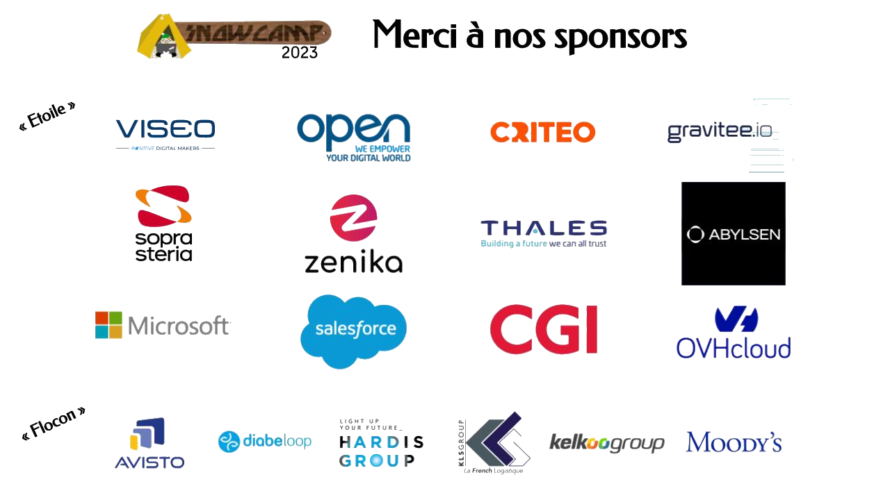
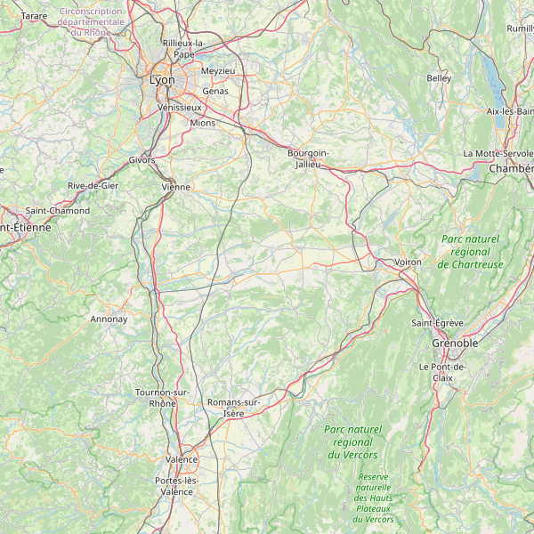
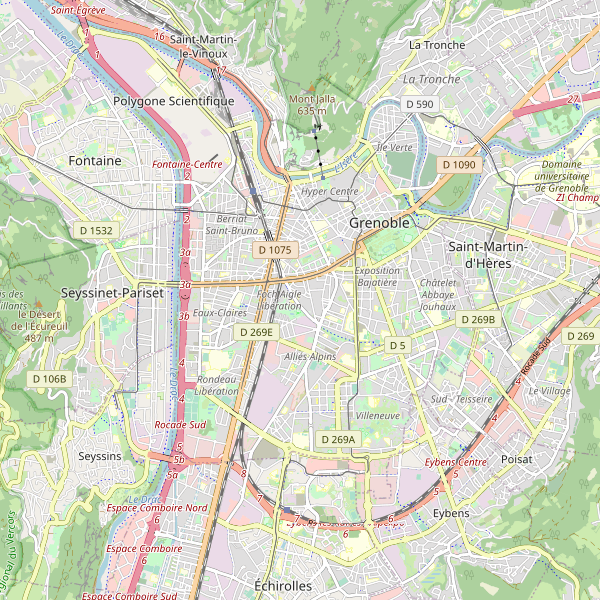
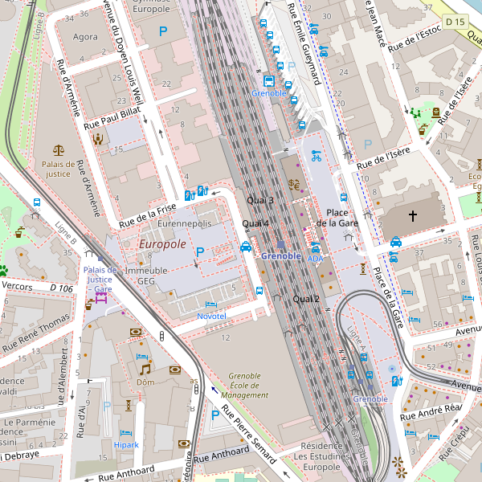

:icons: font
:revealjs_progress: true
:revealjs_previewLinks: true
:revealjs_mouseWheel: true
:revealjs_history: true
:revealjs_preloadIframes: true
:revealjs_plugin_notes: disabled
:customcss: custom.css
:source-highlighter: highlightjs

[%notitle]
= Architecture as code
:sectnums!:

[NOTE.speaker]
--
--

[%notitle]
== Sponsors

[%notitle]
== Qui suis-je ?

Nicolas Delsaux / @riduidel on https://twitter.com/riduidel[icon:twitter[]] / https://github.com/riduidel[icon:github[]] / https://stackexchange.com/users/8620[icon:stack-overflow[]]

Développeur Java depuis l'an 2000

Architecte de solutions/systèmes depuis 2015

Snowcamps

image::images/zenika.png[height=100]

[NOTE.speaker]
--
4ème Snowcamp

Qui était à 

* Kafka, kubernetes, ElasticSearch et Jenkins-X
* Le diable s'habille en Java
* *C4 et au-delà, documenter une architecture agilement*

Cet atelier s'appuie sur celui sur C4, pour ceux qui y étaient, il y aura un peu de redite (mais pas trop)
--

== Pourquoi documenter l'architecture ?

++++

<blockquote class="twitter-tweet">
Because the code is the truth, but not the whole truth.
&mdash; Grady Booch (@Grady_Booch) <a href="https://twitter.com/Grady_Booch/status/1253062981283221504?ref_src=twsrc%5Etfw">April 22, 2020</a></blockquote>  

++++

[NOTE.speaker]
--
On pourrait parler de politique dans les entreprises,
de systèmes socio-techniques, etc...
Mais en fait, c'est tellement plus simple de dire que si le code explique correctement le "comment" d'un logiciel,
il ne répond pas à quelques autres questions
--

=== A quelles questions répondre ?

* Qui ?
* Quand ?
* Quoi ?
* [line-through]#Où ?#
* Pourquoi ?
* [line-through]#Comment ?#

[NOTE.speaker]
--
J'ignorais que https://fr.wikipedia.org/wiki/QQOQCCP[ces questions] provenaient de la méthode aristocélicienne.
En revanche, je connais l'acronyme des 5W et son usage dans le journalisme.
Et je trouve intéressant de se poser la même question à propos d'un système logiciel, précisément parce qu'il s'agit d'un artefact ayant une vie impliquant des personnes aux profils divers.
--

== Mais comment documenter l'architecture ?

Voyons ça à travers un exemple

[NOTE.speaker]
--
C'est un atelier, donc c'est participatif.
En l'occurence, vous allez définir et documenter l'architecture d'un système pour lequel je vais jouer le rôle du client.
Quel système ?
--

=== Skiberté ⛷️

=== A vous de jouer 📝

Règle du jeu

* 30’ Chaque équipe crée un (ou plusieurs) diagrammes décrivant le code dont elle s’occupe
** Le facilitateur est là pour vous aider, n’hésitez pas à le solliciter

* Chaque équipe fournit les différents éléments à l'équipe à sa gauche
* 5’ chaque équipe étudie les diagrammes fournis (vous pouvez mettre des post-its contenant vos questions/interrogations/surprises)

* 5’ Dans chaque équipe, un membre vient montrer comment les use cases sont implémentés

[NOTE.speaker]
--
Pourquoi faire présenter par une autre équipe ?
Parce que c'est drôle ?
Non. Parce que quand on demande aux gens de noter des diagrammes d'architecture, ils mettent une note de 7/10 à à peu près tout ce qu'ils voient. 
Ca n'est donc pas un bon indicateur.
Demander aux gens de restituer un diagramme qu'ils n'ont pas écrit me paraît un meilleur moyen de savoir ce qu'ils en ont compris
--

[background-iframe="https://www.chronometre.fr/minuteur-30-minutes.html"]
[%notitle]
=== A vous de jouer 📝 1 - réflexion

[background-iframe="https://www.chronometre.fr/minuteur-05-minutes.html"]
[%notitle]
=== A vous de jouer 📝 2 - relecture

=== Show time 🎭

=== Comment ça s'est passé ?

Est-ce que vos diagrammes étaient

* légendés ? (on sait ce qu’est chaque patate 🥔 dans le diagramme)
* consistants ? (représentant les mêmes niveaux de détails pour les différents éléments visibles)
* cohérents ? (est-ce que tous les éléments présentés avaient du sens)

=== Passons à une évaluation "rigoureuse"

image::images/c4model-bingo.png[width=900]

[NOTE.speaker]
--
Ce bingo a été créé par Simon Brown à la suite de ses nombreuses animations d'ateliers C4.
Que pensez-vous de vos diagrammes à la lumière de cette évaluation ?
--

== Comment faire mieux ?

[.columns]
=== Avec C4!

[.column]
image::images/simon_brown.png[width=500]

[.column]
* Context, Containers, Components and Code
* Imaginé par Simon Brown https://twitter.com/simonbrown[icon:twitter[] @simonbrown]
* La métaphore habituelle de la carte

[transition=none]
=== C4

[cols="4*", frame=none, grid=none]
|====
.>| image:images/openstreetmap-carte-france.png[]
.>| 
.>| 
.>| 
.<| 
.<| image:images/c4_Containers.png[]
.<| image:images/c4_Components.png[]
.<| image:images/c4_class-diagram.png[]
|====

[transition=none]
=== C4 - Context

[cols="25%, 75%", frame=none, grid=none]
|====
.>| image:images/openstreetmap-carte-france.png[]
.2+a|Présente l’application dans son contexte

* Liste des utilisateurs
** ça n’est pas un hasard si ça ressemble aux user stories
* Liste des systèmes interconnectés
** Même à travers gravitee
** Même à travers Kafka
** Indiquer le type d’interconnexion

.<| 

|====

[transition=none]
=== C4 - Containers

[cols="25%, 25%, 50%", frame=none, grid=none]
|====
.2+|
.>| image:images/openstreetmap-carte-france.png[]
.2+a| Les conteneurs sont les éléments signifiants de l’architecture

* Ce ne sont pas forcément les conteneurs Docker de l’application
* Ce ne sont pas forcément les modules Maven/Gradle de l’application
* Ce ne sont pas forcément les WAR/EJB-JAR

.<| 

|====

[transition=none]
=== C4 - Components

[cols="50%, 25%, 25%", frame=none, grid=none]
|====
.2+a|Si votre framework utilise des composants, c’est cool

* Spring
* Java EE
* GWT
* Swing
* VueJS
* React
* Symphony

.>| 
.2+|
.<| image:images/c4_Components.png[]

|====

[transition=none]
=== C4 - Code

[cols="75%, 25%", frame=none, grid=none]
|====
.2+a|Est-ce qu’on documente son code avec un outil de documentation d’architecture ? Pas forcément

En revanche, on est capable de définir le contexte de ce code

.>| 
.<| image:images/c4_class-diagram.png[]
|====

=== A vous de jouer 📝

Règle du jeu

* 30’ Chaque équipe crée les diagrammes C4 décrivant le code dont elle s’occupe
** Le facilitateur est là pour vous aider, n’hésitez pas à le solliciter

* Chaque équipe fournit les différents éléments à l'équipe à sa gauche
* 5’ chaque équipe étudie les diagrammes fourni (vous pouvez mettre des post-its contenant vos questions/interrogations/surprises)

* 5’ Dans chaque équipe, un membre vient présenter comment les use cases sont implémentés

[background-iframe="https://www.chronometre.fr/minuteur-30-minutes.html"]
[%notitle]
=== A vous de jouer 📝 1 - réflexion

[background-iframe="https://www.chronometre.fr/minuteur-05-minutes.html"]
[%notitle]
=== A vous de jouer 📝 2 - relecture

=== Show time 🎭

=== Comment ça s'est passé ?

Est-ce que vos diagrammes étaient

* légendés ? (on sait ce qu’est chaque patate 🥔 dans le diagramme)
* consistants ? (représentant les mêmes niveaux de détails pour les différents éléments visibles)
* cohérents ? (est-ce que tous les éléments présentés avaient du sens)

== Comment faire mieux ?

[.columns]
=== Structurizr

[.column]
* On construit un modèle (et pas une simple “image”)
* DSL pour les Composants (java, NET, TypeScript, PHP, python, GO)
* Simple à écrire
* Lié au code

[.column]
image::images/structurizr_dsl.png[]

=== A nous de jouer 📝

Démo time !

== Conclusion

=== Qu'est-ce qu'on a gagné ?

* Un modèle de l’architecture de notre application *synchronisé* avec notre code
* La capacité de produire les diagrammes standard à partir du code
* La capacité de décrire aussi les diagrammes de déploiement pour les différents déploiements de l’application
* La capacité d'interroger facilement ce modèle d’architecture
** Produire la cartographie des flux
** Produire un inventaire des machines

=== Voir aussi

++++
<iframe width="560" height="315" src="https://www.youtube.com/embed/UzFpFQgeEyc" title="YouTube video player" frameborder="0" allow="accelerometer; autoplay; clipboard-write; encrypted-media; gyroscope; picture-in-picture; web-share" allowfullscreen></iframe>
++++

=== Quelques ressources

* https://structurizr.com[Structurizr]
* https://arc42.org/[Arc42]

* https://riduidel.github.io/aadarchi/[Aadarchi] (auto-promo)
* https://vistecture.me/[Vistecture]
* https://icepanel.io/[Icepanel]
* https://carbide.dev/[Carbide]

== Merci !

image::https://media.giphy.com/media/1sMH6m5alWauk/giphy.gif[width=200%]