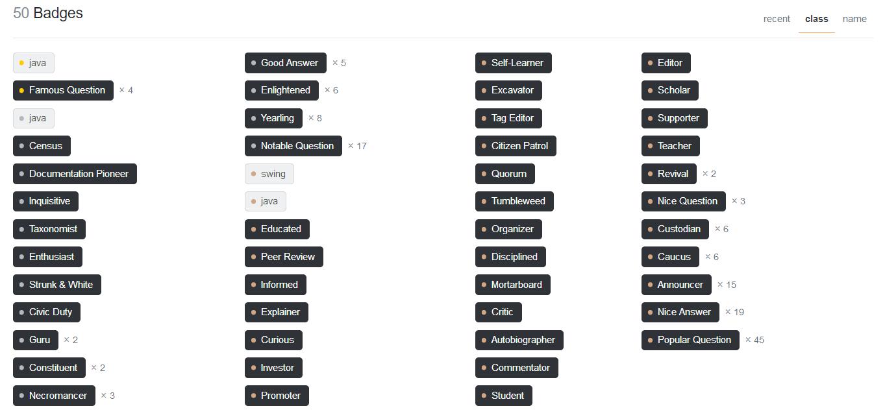
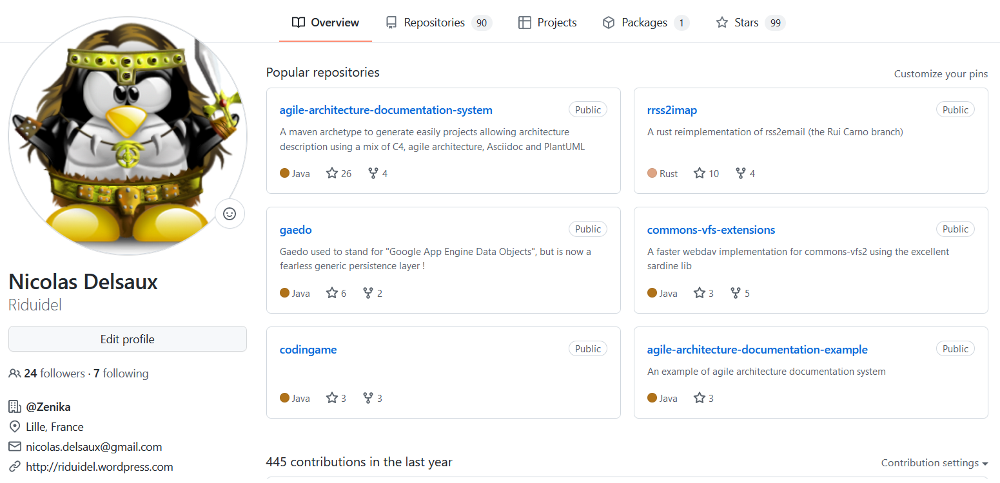
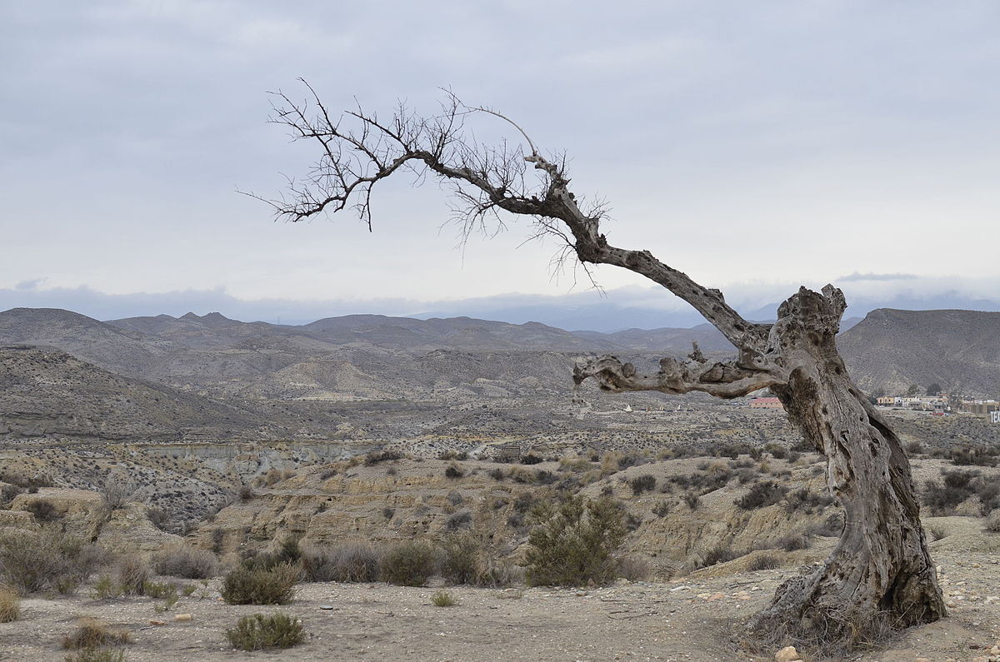
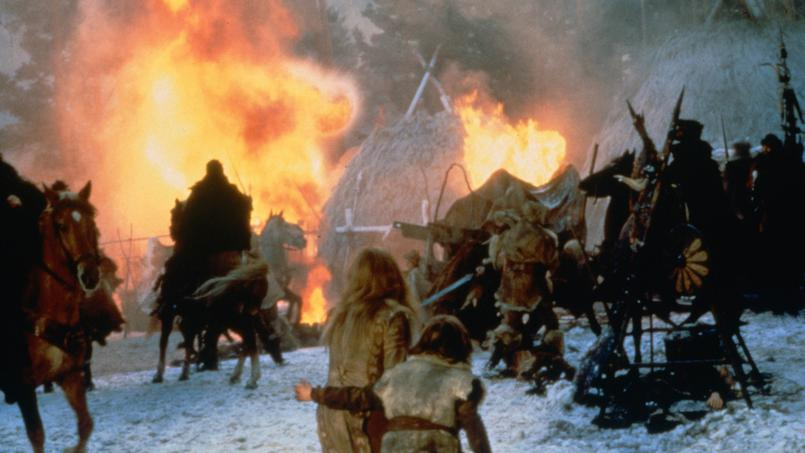
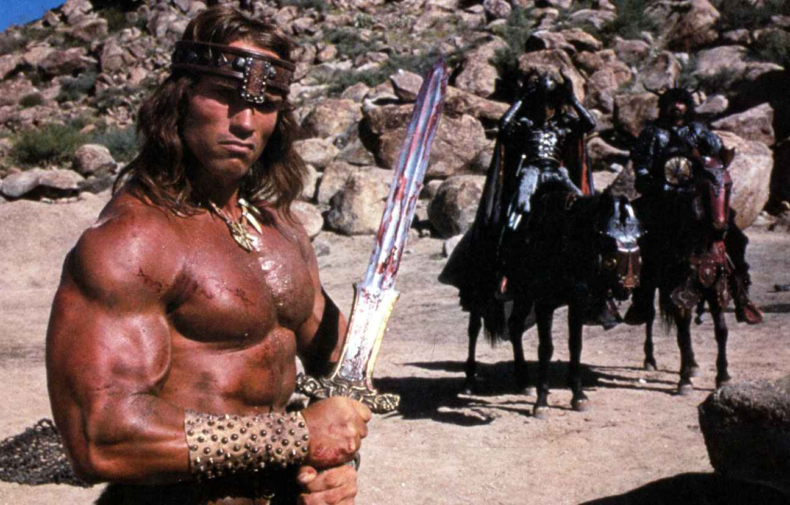
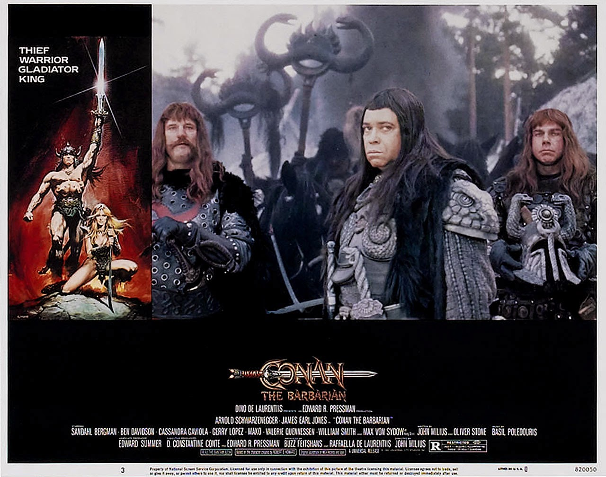
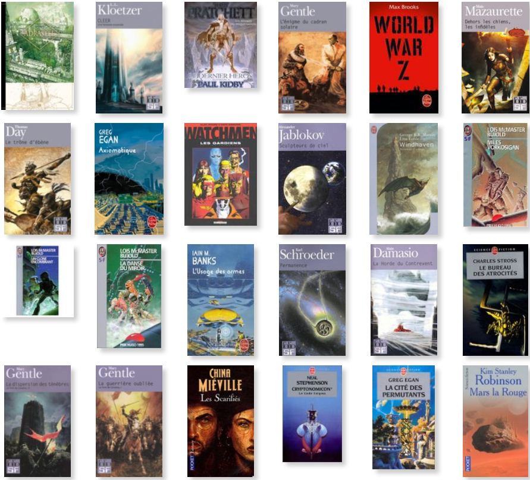
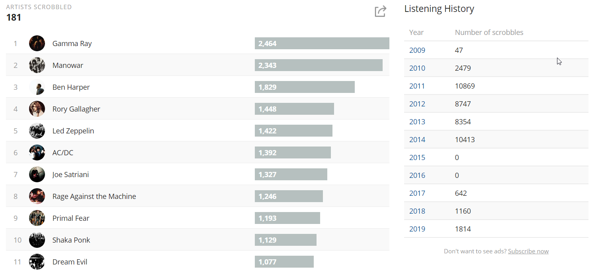

= Nicolas Delsaux

Une présentation désopilante

image::images/desopilant.gif[size=cover]

== Me, myself, and I

* 43 ans
* Marié, deux enfants
* 13 ème entreprise

=== Où ?
* Cambrai, 
* Boulogne s/Mer (le vrai), 
* Paris (et pas la banlieue), 
* Lille (à 100 mètres)

== Tellement de questions

https://stackexchange.com/users/8620[ image:https://stackexchange.com/users/flair/8620.png[]]

=== Et de réponses

== Un peu de code ?

== De la sous-culture comme à Burger Quiz

== Un film préféré ?

=== Un indice ?

=== Un autre indice ?

image::images/Conan_le_barbare_decapitation.jpg[]

=== Encore un indice ?

=== Quasiment la réponse ?

=== Et vraiment la réponse

=== Mais tout ça c'est vieux, non ?

image::images/Cohen-the-last-hero.jpg[]

== Des lectures de bon goût ?

== De la musique de qualité, bien sûr

== Et des podcasts sympa

* Podcast Science
* Salle 101
* Les castcodeurs
* Classic 21 Metal
* Bienvenue à Valnuit
* La méthode scientifique

== Et quelques sites ...

* Coding Horror
* Dan Luu
* Yegor256
* Code Without Rules
* XKCD (et What If)
* Sexactu
* Les 400 Culs