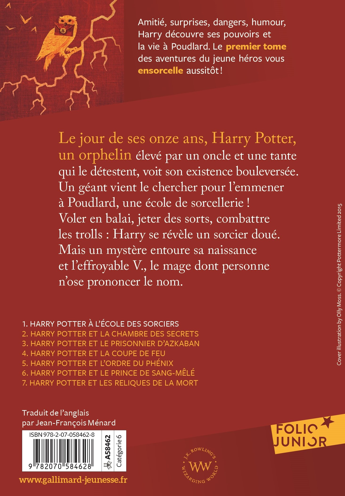

:icons: font
:revealjs_progress: true
:revealjs_previewLinks: true
:revealjs_mouseWheel: true
:revealjs_history: true
:revealjs_preloadIframes: true
:customcss: custom.css
:source-highlighter: highlightjs

[%notitle]
= Nicolas Delsaux

[%notitle]
== Une présentation désopilante
image::images/desopilant.gif[background, size=cover]

== Me, myself, and I

* 47 ans
* Marié, deux enfants
* 10 ème entreprise ...

[%notitle]
=== Où ?

[%notitle]
=== Pourquoi ?
+++
<iframe width="1280" height="800" src="https://www.youtube.com/embed/v9-ZjYkzSxc?controls=0&autoplay=1&start=15" title="YouTube video player" frameborder="0" allow="accelerometer; autoplay; clipboard-write; encrypted-media; gyroscope; picture-in-picture" allowfullscreen></iframe>
+++

[%notitle]
=== Où ?
image::images/carriere.png[background, size=cover]

== Tellement de questions

https://stackexchange.com/users/8620[ image:https://stackexchange.com/users/flair/8620.png[]]

=== Et de réponses

image::images/badges.png[]

== Un peu de code ?
image::images/github.png[]

== De la sous-culture comme à Burger Quiz

=== Un film préféré ?

////
=== Un indice ?

=== Un autre indice ?

image::images/Conan_le_barbare_decapitation.jpg[]

=== Encore un indice ?

image::images/Conan_le_barbare_attaque.jpg[]

=== Quasiment la réponse ?

image::images/Conan_le_barbare_arnold.jpg[]

////

[%notitle]
=== Et vraiment la réponse

[%notitle]
=== Mais tout ça c'est vieux, non ?

image::images/Cohen-the-last-hero.jpg[background, size=cover]

[%notitle, background-iframe="https://www.goodreads.com/review/list/1156136-nicolas?ref=nav_mybooks&shelf=favorites&view=covers"]
=== Des lectures de bon goût ?

=== De la musique de qualité, bien sûr

=== Et des podcasts sympa

* Podcast Science
* Salle 101
* Les castcodeurs
* Classic 21 Metal
* Bienvenue à Valnuit
* La méthode scientifique

=== Et quelques sites ...

* Coding Horror
* Dan Luu
* Yegor256
* Code Without Rules
* XKCD (et What If)
* Sexactu
* Les 400 Culs

== Zenika, comme consultant

image:https://upload.wikimedia.org/wikipedia/fr/thumb/5/5a/Logo_Adeo.svg/langfr-420px-Logo_Adeo.svg.png[height=100]
image:https://upload.wikimedia.org/wikipedia/commons/thumb/c/c4/Decathlon_Logo.svg/langfr-420px-Decathlon_Logo.svg.png[height=100]
image:https://upload.wikimedia.org/wikipedia/commons/thumb/1/1c/ManoMano_2018.png/420px-ManoMano_2018.png[height=120]

=== Zenika, comme DT

Mais ça fait quoi un DT ?

[%step]
* Suivre la carrière des consultants
* Soutenir les consultants en et hors mission
* Animer l'agence
** Organiser des conférences
** Animer des conférences

[%notitle]
=== Zenika, comme speaker

image:images/2019-01-Snowcamp-2019.jpg[alt=Snowcamp 2019, height=272]
image:images/2019-06-Adeo-Dev-Summit-2019.jpg[[alt=Adeo Dev Summit, height=272]
image:images/2019-06-Chtijug.jpg[[alt=Chtijug, height=272]
image:images/2020-01-Snowcamp.jpg[[alt=Snowcamp 2020, height=272]

=== Mais pourquoi animer une conférence ?

== Ca sert à quoi une entreprise ?

[%step]
* L'argent n'est pas le but, mais le moyen
* Les valeurs de Zenika, c'est ...
** Transparence
** Partage
** Convivialité
* Des consultants animés par la passion

[.columns]
=== Alors pourquoi animer une conférence ?

[.column]
Pour partager

[.column]
Pour découvrir

[.column]
Pour réfléchir

=== Quelques exemples de sujets

De 0 à 100 avec Accelerate 🧑‍🎓
Comment jouer avec les règles 🧑‍🎓
Extreme feedback : comment le feedback rapide a fait de moi un meilleur développeur 💡
Archéologie logicielle : risques, outils, méthodes 💡
L'art de la déduction 🧑‍🎓
La plateforme du futur 💡
Comment travailler 20 ans dans l'informatique sans pas devenir cinglé ? 💡
**Le diable s'habille en Java** 🤩
Voyage en code inconnu 💡
Cap'tain .adoc💡
La tradition orale dans le développement 💡
Engagement, identité et idiocratie 🧑‍🎓
Un visiteur venu d'ailleurs 🧑‍🎓
**C4 et au-delà : documenter une architecture agilement** 🤩

=== Mais comment faire ?

. Avoir une idée
. Ecrire un sujet de conférence
. Préparer la conférence
. Présenter la conférence

=== Avoir une idée

Il n'y a pas de mauvaise idée, seulement des contextes inadaptés

[%step]
* Vos expériences
* Vos succès
* Vos échecs
* Vos découvertes

[.columns]
=== Ecrire un sujet de conférence

[.column]

[.column]

[%step]
* Décrire votre conférence (quel domaine, quelle techno)
* Présenter l'histoire (qui ? quand ? quoi ? où ? comment ? pourquoi ?)
* Séduire le comité de sélection

=== Préparer la conférence

[%step]
* **Préparez votre planning**
* Assumez votre style
* Racontez votre histoire
* Choisissez votre outil de présentation (PowerPoint, (Asciidoctor-)Revealjs, Prezi, slides.com, live-coding)
* Ecrivez vos supports (trouvez votre style, testez des choses)
* Répétez avec vos collègues

=== Présenter la conférence

[%step]
* Tout le monde a le trac
* Personne (ou presque) n'est venu pour vous déglinguer
* Vous avez le droit d'avoir des problèmes techniques
* Vous n'avez pas le droit d'être spectateur
* C'est votre histoire

[.columns]
=== Pourquoi je parle d'histoire ?

[.column]
image::https://i.gr-assets.com/images/S/compressed.photo.goodreads.com/books/1602337432l/55616466._SX318_.jpg[height=800]

[.column]

[%step]
* L'homme mémorise mieux l'histoire que les faits bruts
* Assister à une conférence, c'est faire communauté
* La bande passante d'une conférence est bien plus faible que celle d'un article

=== Mais ça ne pose pas un problème ?

Tiré de https://sliard.medium.com/point-de-vue-sur-les-conf%C3%A9rences-c2c22d87b2fb[Point de vue sur les conférences]

=== Petit exercice

[%step]
* En 5 minutes, trouvez autant d'idées de conférences que vous pouvez
* Au bout de 5 minutes, en binôme, échangez sur les idées et faites-en des sujets en 5 minutes
* Présentez votre meilleure idée au groupe
* Vous êtes prêts pour votre prochain TZ

== Merci !

image::https://media.giphy.com/media/1sMH6m5alWauk/giphy.gif[width=200%]