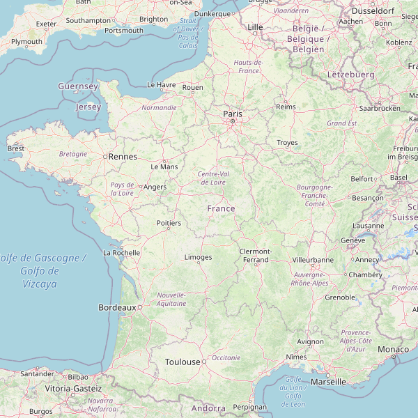

:icons: font
:revealjs_progress: true
:revealjs_previewLinks: true
:revealjs_mouseWheel: true
:revealjs_history: true
:revealjs_preloadIframes: true
:revealjs_plugin_notes: disabled
:revealjs_plugins: {slidesdir}/plugins.js
:revealjs_plugins_configuration: {slidesdir}/configs.js
:customcss: custom.css
:source-highlighter: highlightjs

[%notitle]
= C4 et au-delà, documenter agilement une architecture
:sectnums!:

[NOTE.speaker]
--
Checklist avant conférence

. Ouvrir le dossier `C:\Users\nicolas-delsaux\Documents\Zenika\conferences\c4_et_au_dela\example\architecture` dans VSCode (il contient les snippets)
. Démarrer structurizr-lite `docker run --rm --name structurizr-lite -d -p 18080:8080 -v %CD%/c4_et_au_dela/example/architecture:/usr/local/structurizr structurizr/lite`
. Démarrer OBS Studio et ouvrir la scène **snowcamp-structurizr**
. Parcourir la présentation une fois en warmup pour tout démarrer correctement
. Configurer le workspace VSCode d'exemple pour avoir les retours à la ligne
--

[%notitle]
== Sponsors

image::images/snowcamp-sponsors.png[background, size=cover]

== C4 et au-delà, documenter agilement une architecture

[%notitle, background-iframe="https://manifesteagile.fr/#valeurs"]
== Ca ne sert à rien, on est agiles

[NOTE.speaker]
--
Pourquoi documenter quand le manifeste agile dit clairement qu'il faut privilégier

[quote, https://manifesteagile.fr/#valeurs]
> Des solutions opérationnelles, de préférence à une documentation exhaustive

Précisément parce que le manifeste parle de privilégier, et pas d'éliminer.
Et dans cette présentation, on va précisément parler de moyens de produire plus de documentation avec moins de travail.
--

[%notitle]
== Qui suis-je ?

Nicolas Delsaux / @riduidel on https://twitter.com/riduidel[icon:twitter[]] / https://github.com/riduidel[icon:github[]] / https://stackexchange.com/users/8620[icon:stack-overflow[]]

Développeur Java depuis l'an 2000

Architecte de solutions/systèmes depuis 2015

image::images/zenika.png[height=100]

[NOTE.speaker]
--
En tant que développeur et architecte, je me suis beaucoup intéressé à la question de la documentation d'architecture.
--

== Pourquoi documenter l'architecture ?

++++

<blockquote class="twitter-tweet">
Because the code is the truth, but not the whole truth.
&mdash; Grady Booch (@Grady_Booch) <a href="https://twitter.com/Grady_Booch/status/1253062981283221504?ref_src=twsrc%5Etfw">April 22, 2020</a></blockquote>  

++++

[NOTE.speaker]
--
On pourrait parler de politique dans les entreprises,
de systèmes socio-techniques, etc...
Mais en fait, c'est tellement plus simple de dire que si le code explique correctement le "comment" d'un logiciel,
il ne répond pas à quelques autres questions
--

=== A quelles questions répondre ?

* Qui ?
* Quand ?
* Quoi ?
* [line-through]#Où ?#
* Pourquoi ?
* [line-through]#Comment ?#

[NOTE.speaker]
--
J'ignorais que https://fr.wikipedia.org/wiki/QQOQCCP[ces questions] provenaient de la méthode aristocélicienne.
En revanche, je connais l'acronyme des 5W et son usage dans le journalisme.
Et je trouve intéressant de se poser la même question à propos d'un système logiciel, précisément parce qu'il s'agit d'un artefact ayant une vie impliquant des personnes aux profils divers.
--
=== Comment répondre à ces questions ?

image::https://media.giphy.com/media/j3cIiYP90ci1QgyWAk/giphy.gif[]

[NOTE.speaker]
--
Bien sûr qu'il faut communiquer, mais via quels moyens ?
--

[.columns]
[%notitle]
=== Some poor solutions (we all use)

[.column]
* **Outil dédié**
** Complet icon:check-circle[role=green]
** Difficile à exporter icon:times-circle[role=red]
** Difficile de monter en compétence icon:times-circle[role=red]

[.column]
* **Tableau blanc** (physique ou virtuel)
** Facile à utiliser icon:check-circle[role=green]
** Aucune cohérence icon:times-circle[role=red]
** Durée de vie inconnue icon:times-circle[role=red]

[NOTE.speaker]
--
La plupart du temps, les architectes disposent d'un spectre d'outils allant du tableau blanc, qu'il soit physique ou virtuel (draw.io, Miro, Mural, ...), aux outils dédiés (Archi, les outils UML, ...).
Ces outils ont évidement des avantages diférents, associés à des inconvénients différents.
Sans doute parce qu'ils s'adressent à des publics *très* différents, dans des phases différentes du cycle de vie de l'application.
Et quand on regarde, il semble évident qu'il puisse exister un outillage entre ces deux extrêmes, disposant de qualités différentes, pour fournir un outil utile aux différents membres de l'équipe.
--

[.columns]
== C4

[.column]

[.column]
* Context, Containers, Components, Code
* La métaphore classique de la carte
* Imaginé par Simon Brown (https://twitter.com/riduidel[icon:twitter[] @simonbrown])

[NOTE.speaker]
--
Le concepte de C4 est très simple, et c'est la raison pour laquelle il est aussi utile dans une période de simplification.
On part du contexte du système pour arriver au code en passant par deux étages intermédiaires.
Simon Brown habite Jersey, et du coup il fait d'habitude une présentation qui emmène les gens jusque sur son île.
Aujourd'hui, on est à Grenoble, on va donc plutôt vous emmener jusqu'ici ...
--

[%notitle, background-color="white"]
=== Un exemple rapide ?

image::images/spring-pet-clinic-github.png[size=cover]

[NOTE.speaker]
--
**Demander qui connaît PetClinic

Histoire de se fixer les idées, on va partir d'un projet plutôt connu dans le monde Java : icon:github[set=fab] https://github.com/spring-projects/spring-petclinic#readme[spring pet clinic].
C'est un exemple d'application Spring assez simple qui leur permet d'exposer les différentes fonctionnalités
--

=== Context

[cols="2", width="100%", frame=none, grid=none]
|===
|

|
+++
<iframe id="pet-clinic-context" data-src="https://structurizr.com/static/assets/structurizr-1-diagrams.html#context" width="800" height="600"  ></iframe>
+++
|===

[NOTE.speaker]
--
Présente l’application dans son contexte
* Liste des utilisateurs (ça n’est pas un hasard si ça ressemble aux user stories)
* Liste des systèmes interconnectés (Même à travers un API Manager ou  Kafka, n'oubliez pas d'indiquer le type d'interconnexion)

En revanche, on ne s'intéresse pas aux technologies, ni aux protocoles de communication.

Au passage, notez que si dans le diagramme on s'intéresse aux interconnexions, 
c'est également vrai sur la carte : on voit déja les autoroutes, et on verra très vite les lignes de chemin de fer.
--

=== Containers

[cols="2", width="100%", frame=none, grid=none]
|===
|
image:images/openstreetmap-carte-savoie.png[width="600", height="600"]
|
+++
<iframe id="pet-clinic-containers" data-src="https://structurizr.com/static/assets/structurizr-1-diagrams.html#containers" width="800" height="600"  ></iframe>
+++
|===

=== Containers

* Les conteneurs ne sont pas forcément des conteneurs Docker (par exemple dans un monolithe)
* Les conteneurs ne sont pas forément des modules Maven/Gradle/... (par exemple dans des microservices)

* Les conteneurs sont des éléments signifiants de l'architecture. Et **ça dépend fortement de l'architecture**

[NOTE.speaker]
--
Dans la définition, Simon brown indique

[quote, Simon Brown]
>  Essentially, a container is a separately runnable/deployable unit (e.g. a separate process space) that executes code or stores data.

En vérité, ça se discute, et il peut être parfois intéressant 
de séparer plusieurs conteneurs tournant dans le même process (typiquement dans un monolithe significatif)
--

[%notitle]
=== Components
[cols="2", width="100%", frame=none, grid=none]
|===
|
image:images/openstreetmap-carte-grenoble.png[width="600", height="600"]
|
+++
<iframe id="pet-clinic-components" data-src="https://structurizr.com/static/assets/structurizr-1-diagrams.html#components" width="800" height="600"  ></iframe>
+++
|===

=== Components

Si votre framework utilise des composants, c'est cool !

image:images/spring-3-logo-png-transparent.png[height=50]
image:images/javaee.png[height=100]

image:images/vue-js.png[height=50]
image:images/reactjs.png[height=50]
image:images/angular.png[height=50]

[%notitle]
=== Code

[cols="2", width="100%", frame=none, grid=none]
|===
|
image:images/openstreetmap-carte-gare.png[width="600", height="600"]
|

image:images/spring-OwnerController.png[]

|===

[NOTE.speaker]
--
J'ai mis ici un lien direct vers le code.
Mais il peut être intéressant de documenter plus précisément 
les interactions entre les différents éléments qui forment le composant (dans un framework MVC, par exemple).
--

[%notitle]
=== C'est bien, mais

image::https://media.giphy.com/media/YoWYbUDeJK6Telrvzs/giphy.gif[]

[%step]
* Les diagrammes peuvent être inconsistants
* Les diagrammes ne peuvent pas répondre à toutes les questions
* Les diagrammes peuvent ne pas être à jour

[NOTE.speaker]
--
On va d'abord se concentrer sur le premier point (sinon je ne l'aurais pas mis en premier).
--

== Comment rendre les diagrammes consistants

[%step]
En les basant sur un modèle !

[%notitle, background-iframe="https://structurizr.com/"]
=== Structurizr

[NOTE.speaker]
--
Le fait que C4 ne soit qu'un dessin est un inconvénient connu de son créateur, Simon Brown, qui a développé une suite d'outils, collectivement appelés Structurizr.
On a donc 
* Un DSL basé sur Kotlin (qu'on va tout de suite tester)
* Un outil d'affichage des diagrammes en local (structurizr-lite) et en SaaS (Structurizr)
* Des librairies permettant de créer des modèles d'architecture dans un certain nombre de langages
--

[%notitle]
=== Structurizr DSL

image::images/structurizr_dsl.png[[canvas,size=contain]

+++
<section data-video="big">
<!-- Démo de Structurizr-lite déclenchée à travers OBS -->
</section>
+++

[NOTE.speaker]
--
Dans cette démo, on va créer un fichier `structurizr.dsl` et y décrire un modèle d'architecture incluant des conteneurs, des composants et des vues diverses.
--

[%notitle]
=== Début de la démo

image::https://media.giphy.com/media/Y1XrxoBKZHTHeky1Wy/giphy.gif[]

[%notitle]
== C'est bien, mais

image::https://media.giphy.com/media/YoWYbUDeJK6Telrvzs/giphy.gif[]

[%step]
* Les diagrammes ne peuvent pas répondre à toutes les questions
* Les diagrammes peuvent ne pas être à jour

[NOTE.speaker]
--
Aucune carte n'a empêché quelqu'un de se perdre.
Parce qu'une carte explique la géographie, et pas l'histoire (et les deux se mélangent souvent).
--

== Comment raconter l'histoire ?

[%notitle]
=== Avec un bon plan

image::images/agile-architecture-documentation.png[background, size=cover]

[NOTE.speaker]
--
C'est un plan très complet, et utilisable quelquesoit votre mode de documentation
(Word/Google Docs, Wiki, Site généré depuis Markdown/Asciidoc).
Et c'est cool, parce que ça permet de rapprocher la documentation du code.
--

=== C'est bien, mais

image::https://media.giphy.com/media/fatcd1PnHPTDW/giphy.gif[]

* Les diagrammes peuvent ne pas être à jour

[.columns]
== Et si ...

[.column]

[.column]
[%step]
* On utilisait le principe DRY
* Et le fait que le modèle Structurizr soit exprimé par du code

[NOTE.speaker]
--
On sait qu'on peut mettre de la génération de documentation et de diagramme dans du code.
Alors pourquoi ne pas faire de la documentation d'architecture un module de l'application ?
--

=== Nous avons déja les infos

* Où sont nos conteneurs ?
** Dans maven ? On peut les trouver
** Dans Kubernetes ? On peut les trouver
* Où sont nos composants ?
** Dans maven ? On peut les trouver

=== Nous savons déja produire du code complexe

* Nous utilisons la CI/CD pour do cude bien plus complexe que la documentation
* Nous disposons déja d'outils d'industrialisation de code sophistiqués

[%notitle,background-iframe="https://riduidel.github.io/agile-architecture-documentation-system/"]
=== architecture-as-code

=== Avec ça, tout est possible !

++++

<blockquote class="twitter-tweet">
As an example, I&#39;ve already used Hashicorp Vault Java client, GitHub client API and Kubernetes client to populate my model from informations already existing, so I guess it&#39;s possible to get users/containers/components from a reference system ...
&mdash; Nicolas Delsaux (@riduidel) <a href="https://twitter.com/riduidel/status/1280395424654901248?ref_src=twsrc%5Etfw">July 7, 2020</a></blockquote>  

++++

=== Et c'est même assez simple

[%step]
* Récupérer le déploiement grâce à https://github.com/fabric8io/kubernetes-client[fabric8 Kubernetes Client]
** Récupérer les URLs de base de données avec https://bettercloud.github.io/vault-java-driver/[Vault Java Driver]
* Récupérer les README des conteneurs de microservices avec https://github-api.kohsuke.org/[github-api]

== Merci !

image::https://media.giphy.com/media/1sMH6m5alWauk/giphy.gif[width=200%]

[.columns]
== Références

[.column]
Donnez votre avis sur roti.express !
image::images/url_roti.express.png[]

[.column]
* https://www.c4model.com[C4Model]
* https://www.structurizr.com[Structurizr]
* https://github.com/structurizr/java-extensions/blob/master/docs/spring-petclinic.md[Structurizr appliqué à Spring Pet Clinic]
* Slides disponibles sur https://github.com/Riduidel/conferences/c4_et_au-dela/src/slides/asciidoc

=== Si vous voulez les slides

