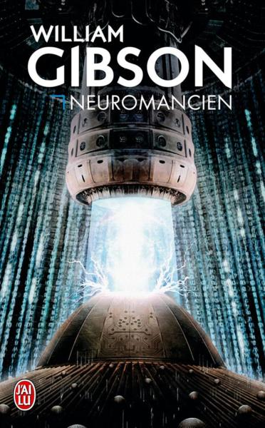
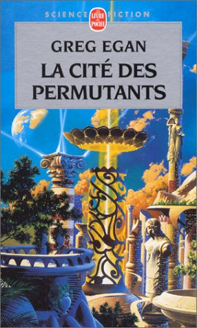

= Cyberpunk ou modernité ?

pass:[<small>Des opinions ... potentiellement politiques ... peuvent apparaître.</small>]

== Pourquoi ?

[NOTE.speaker]
--
On voit de l'IA partout.

La "singularité" est un mot à la mode.

L'augmentation corporelle aussi.

Tout ça a été décrit dans la littérature de SF il y a entre 30 et 40 ans.

Il m'a paru intéressant de voir comment la "technoculture" s'imprégnait de ces idées.
--

== C'est quoi ?

[quote, Bruce Sterling, https://fr.wikipedia.org/wiki/Cyberpunk]
____
Le courant cyberpunk provient d'un univers où le dingue d'informatique et le rocker se rejoignent, d'un bouillon de culture où les tortillements des chaînes génétiques s'imbriquent.
____

[NOTE.speaker]
--
Contrairement à la hard-science ou au space-opera (autres courants SF), le cyberpunk tire un certain nombre de ses aspects du roman noir ou de l'étude sociale.
--

== Des exemples ?

  image:images/schismatrice.jpg[height=400]

[NOTE.speaker]
--
Neuromancien est l'exemple typique du roman cyberpunk : dans un monde vraiment sombre, Johnny Mnemonic transporte des informations confidentielles dans ses implants, ce qui le fait voyager à travers toutes les strates de la société.

Mozart en verres miroirs est l'anthologie manifeste du courant, quif ait le tour des interrogations de ces auteurs.

Schismatrice explore le système solaire à la suite d'un looser magnifique, qui va faire le tour des différents modes d'existence. on y croise des "homards" survivant dans l'espace grâce à leurs scaphandres, des vieillards visant l'immortalité dans le luxe, et beaucoup de pauvres types peinant à joindre les deux bouts.
--

== Humains augmentés

=== De meilleurs yeux

 

=== Mais

* Quel est l'impact sur la vie privée ?
* Comment survivre à la surcharge d'information ?
* A-t-on encore une vision indépendante du monde ?

=== De meilleurs membres

 

=== Mais

* Les prothèses évoluées reposent sur des applications ... pas toujours sécurisées
* Les prothèses ne sont pas auto-réparables (contrairement au squelette)
* D'un point de vue biomécanique, c'est peu plausible

== Vaincre la mort

=== Numériser l'esprit

 

=== Mais

* Détenir le support, c'est détenir l'esprit
* "L'esprit n'est qu'un jouet pour le corps"
* Un esprit numérisé est-il vivant ?
* Deux instances du même esprit sont-elles des personnes différentes ?

=== Vaincre la maladie

 

=== Mais

* Une société d'immortels est-elle condamnée à la stagnation ?
* Peut-on nourir une population sans cesse croissante sur une planète qui ne grandit pas ?

== La fin des états

=== Imaginaire ?

  

=== Ou réalité ?

=== Ou réalité ?

