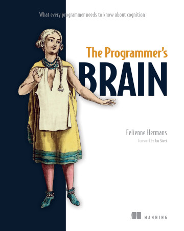
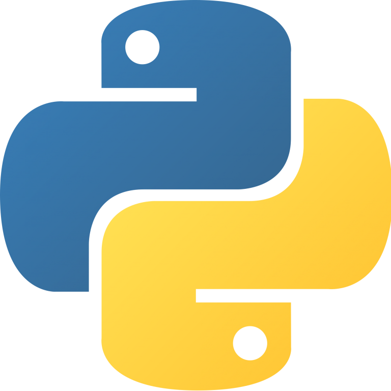
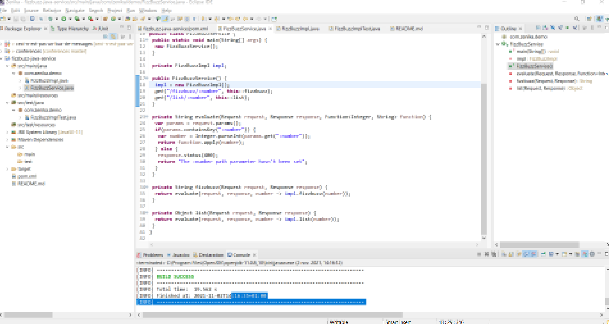

:icons: font
:revealjs_progress: true
:revealjs_previewLinks: true
:revealjs_mouseWheel: true
:revealjs_history: true
:revealjs_plugin_notes: disabled
:customcss: custom.css
:source-highlighter: highlightjs

:notitle:
= Découvrir de nouveaux langages ?

[%notitle]
== Qui suis-je ?

Nicolas Delsaux / @riduidel on https://twitter.com/riduidel[icon:twitter[]] / https://github.com/riduidel[icon:github[]] / https://stackexchange.com/users/8620[icon:stack-overflow[]]

Développeur Java depuis l'an 2000

[%notitle]
== Avertissement

+++

<blockquote class="twitter-tweet" data-conversation="none">
..I wouldn&#39;t soften the language — I keep stating that I feel like programming languages are not sports teams to cheer for, so there&#39;s no good reason to take any part of the rant personally: I aim to be kind, not necessarily nice).
&mdash; fasterthanlime 🌌 (@fasterthanlime) <a href="https://twitter.com/fasterthanlime/status/1455483639161049089?ref_src=twsrc%5Etfw">November 2, 2021</a></blockquote>  

+++

== Pourquoi ?

=== Pourquoi programmer est une activité complexe ?

[%step]
* Mémoire à court terme et à long terme
* On mémorise des concepts
* La communication est plus utile que les maths

[NOTE.speaker]
--
https://www.manning.com/books/the-programmers-brain[The programmer's brain] est un très bon livre qui détaille tous les éléments qui rendent la programmation complexe.
Pour notre discussion, on va se focaliser sur trois aspects importants impactant, selon moi, le choix d'un langage de programmation.
--

=== Pourquoi j'apprends de nouveaux langages ?

[%step]
* Pour découvrir de nouveaux concepts
* Pour ne pas subir l'hypothèse de Sapir-Whorf

[NOTE.speaker]
--
Mes enfants ont posé la question.
A quoi sert un langage de programmation ? 
Comme pour un langage, ça sert à dialoguer, en l'occurence avec un ordinateur.

Dans la linguistique, il y a eu il y a quelques années une intéressante controverse autour de l'hypothèse de https://fr.wikipedia.org/wiki/Hypoth%C3%A8se_de_Sapir-Whorf[Sapir-Whorf]
--

== Quelques exemples de langages alternatifs

[NOTE.speaker]
--
Ces exemples sont évidement datés, mais c'est parce qu'ils viennent de mon histoire personnelle
--

[%notitle,background-iframe="https://www.ruby-lang.org/fr/"]
== Ruby

[%notitle,background-iframe="https://steveklabnik.com/writing/matz-is-nice-so-we-are-nice"]
=== Matz is nice, so we are nice

[%notitle,background-iframe="http://rubylearning.com/satishtalim/duck_typing.html"]
=== Duck typing FTW!

[%notitle,background-iframe="https://scribe.rip/podiihq/method-missing-in-ruby-af4c6edd5130"]
=== method_missing

[%notitle,background-iframe="https://docs.oracle.com/javase/7/docs/api/java/lang/reflect/Proxy.html"]
=== Et sa version Java

[%notitle,background-iframe="https://rubyonrails.org/"]
=== Ruby on Rails

[%notitle,background-iframe="https://poignant.guide/"]
=== Why's poignant guide

[%notitle,background-iframe="https://en.wikipedia.org/wiki/Why_the_lucky_stiff#Books"]
=== Why's poignant legacy

[%notitle,background-iframe="http://www.groovy-lang.org/"]
== Groovy

[%notitle,background-iframe="https://dev.to/jcoelho/10-reasons-to-use-groovy-in-2019-431f"]
=== 10 bonnes raisons

[%notitle,background-iframe="https://blog.mrhaki.com/2009/10/groovy-goodness-expando-as-dynamic-bean.html"]
=== Mais aussi les Expando!

[%notitle,background-iframe="https://www.jenkins.io/doc/book/pipeline/jenkinsfile/"]
== Mais c'est pas mort ?

[%notitle,background-iframe="https://github.com/kdabir/awesome-groovy#build-tools-setup-and-ci"]
== Mais c'est pas mort (en dehors de la CI)

[%notitle]
== Mais aussi

image:images/JavaScript_logo.png[width=400]

[%notitle,background-iframe="https://www.rust-lang.org/fr/"]
== Et bien sûr Rust!

=== Pourquoi apprendre Rust ?

=== D'où vient le Rust ?

* Inventé chez Mozilla Research
* Utilisé pour éviter certains "problèmes" liés au C++

[NOTE.speaker]
--
Il faut parler en particulier des histoires de pointeurs désalloués.
--

=== Qu'est-ce que Rust apporte ?

[cols=2*] 
|===
| Minimal runtime
| Fast
| Open source
| Algebraic data types
| Pattern matching
| Type inference
| Guaranteed memory safety
| Concurrent
| Practical
| Efficient C bindings
|===

[NOTE.speaker]
--
D'après https://stackshare.io/rust[StackShare]

On va se focaliser un peu sur trois aspects clés

* Guaranteed memory safety
* Algebraic data types
* Pattern matching

Tout le reste est assez "standard" : c'est un langage qui se compile à travers LLVM (pas d'inquiétude, vous ne vous en rendrez pas compte) pour produire des exécutables natifs. Donc avec peu d'empreinte mémoire.
Et comme c'est un langage natif, et que les gens qui s'en servent font pour l'instant beaucoup de programmation système, il y a des bindings en C qui marchent bien (et c'est à mon avis quasiment une mauvaise nouvelle).
--

=== Quelques projets

* https://servo.org/[Firefox Servo]
* https://conduit.io/[Conduit] service mesh
* https://www.sozu.io/[SŌZU]

[%notitle,background-iframe="https://github.com/rust-unofficial/awesome-rust#applications"]
=== Ou encore

=== Comment on s'en sert ?

Deux composants essentiels

* rustup gère les composants système de Rust
* cargo est l'outil de build Rust

Et des supports pour les IDE avec https://github.com/rust-lang-nursery/rls[RLS] et un bon site d'état du support des IDE (https://areweideyet.com/[Are we (I)DE yet?])

[%notitle]
=== Démo !

[NOTE.speaker]
--
Tout le monde voit ce qu'est fizzbuzz ?

Si c'est un multiple de 3, on le remplace par ... "Fizz".
Si c'est un multiple de 5, on le remplace par ... "Buzz".
Et si c'est un multiple des deux, on le remplace par ... "FizzBuzz" (dans l'ordre) ;-)
--

== Quelques liens

* https://doc.rust-lang.org/rust-by-example/[Rust by Example]
* https://stevedonovan.github.io/rust-gentle-intro/readme.html[A Gentle Introduction To Rust]
* https://doc.rust-lang.org/book/second-edition/[The Rust Programming Language]
* https://github.com/rust-unofficial/awesome-rust[Awesome Rust]
* https://www.rust-lang.org/fr-FR/friends.html[Amis de Rust]

== Conclusion

[%notitle,background-iframe="https://blogit.michelin.io/clojure-programming/"]
=== Un paysage toujours mouvant

[%notitle,background-iframe="https://blog.frankel.ch/on-learning-new-programming-language/"]
=== Une autre opinion

[%notitle,background-iframe="https://www.docker.com/"]
=== Tout ça est de moins en moins important

== Merci

image::https://media.giphy.com/media/xT8qB3XvvuhoYG9MNa/giphy.gif[]