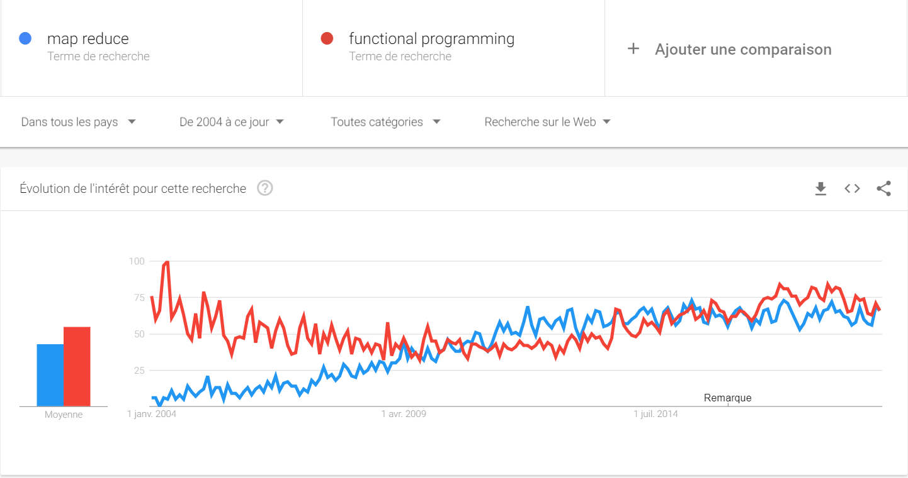
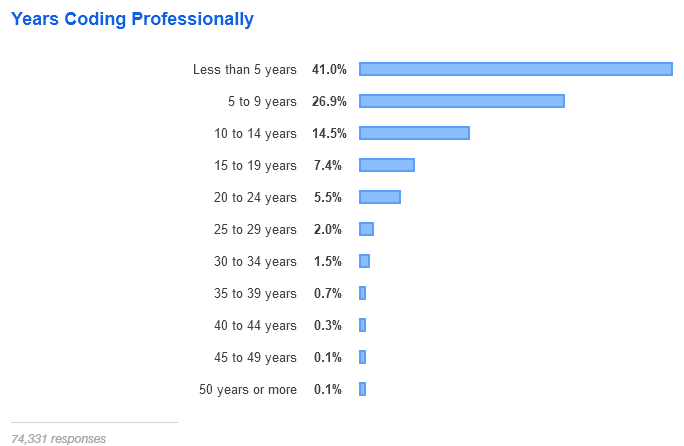

:icons: font
:revealjs_progress: true
:revealjs_previewLinks: true
:revealjs_mouseWheel: true
:revealjs_history: true
:customcss: custom.css
:source-highlighter: highlightjs

:notitle:
= Le diable s'habille en java

[%notitle]
== Générique

image::images/generique.jpg[background, size=cover]

[NOTE.speaker]
--
Attention, cette présentation contient des éléments susceptibles de choquer (d'où le "-18").

Combien d'entre vous sont sensibles aux modes ?
--

[%notitle]
=== Une équipe de Rugby en l'an 2000

[NOTE.speaker]
--
Sur cette image, il manque quelque chose.

Vous voyez beaucoup de barbus ?

Et quand vous regardez autour de vous, vous en voyez beaucoup (moi aussi, j'en vois partout).

Alors, est-ce que la barbe ne serait qu'une mode ?

Et si c'est une mode, qu'est-ce qui vous pousse à y céder ?

* La pression des pairs ?
* Des incitations subtiles ?
** Les barbiers
** L'émergence de gammes de cosmétiques pour hommes

Evidement, tout ça n'a rien à faire en informatique ...
--

[%notitle]
=== Une entreprise dans les années 80

[NOTE.speaker]
--
Cette photo vient du site de http://www.bajart.be/entreprise/historique/[l'entreprise Bajart] (qui n'est pas le sujet de cette présentation).

La plupart d'entre vous (et moi-même, d'ailleurs) portons régulièrement des jeans ?
Pourquoi ?
Parce que c'est tendance ?
Sûrement pas, puisque nous ne sommes pas sensibles aux modes ...
Non, c'est parce que le jean, c'est solide, c'est pratique, c'est passe-partout.

Qu'est-ce que je veux dire par là ? 
Qu'il y a des modes, et que certaines sont pratiques.
Et que si on reparle des barbes, d'autres sont peut-être un peu moins révolutionnaires.
--

[%notitle]
== Qui suis-je ?

Nicolas Delsaux / @riduidel on https://twitter.com/riduidel[icon:twitter[]] / https://github.com/riduidel[icon:github[]] / https://stackexchange.com/users/8620[icon:stack-overflow[]]

Développeur Java depuis l'an 2000

// OK pour l'intro

== Revenons à l'informatique

[quote, Charles Lehalle, circa 1999]
--
En informatique, tout est dans tout
--

[NOTE.speaker]
--
J'ai travaillé avec https://fr.wikipedia.org/wiki/Charles-Albert_Lehalle[Charles-Albert Lehalle] autour de l'an 2000. 
Dans cette boîte, on faisait du C++ et du Scheme pour concevoir des logiciels de réseaux de neurones.
A cette époque, on savait déja que le progrès en informatique était un peu derrière nous.
Du coup, la plupart des progrès n'étaient pas vraiment des innovations, mais des modes.

Pourquoi parler de modes en informatique ?

Après tout nous sommes des professionnels de la technique, guidés par des choix rationnels, non ?

Mais en informatique, on peut utiliser n'impote quelle solution, pourvu qu'elle marche, non ?
--

=== Autrement dit ?

* Est-ce qu'on utilise nos méthodes, nos outils pour leurs qualités ?
* Ou pour d'autres raisons

=== Mais qu'est-ce qu'on fait ?

[plantuml, {plantumldir}une_application_simple, png]
----
actor User
component Application
database Database

User <-> Application
Application <-> Database
----

[NOTE.speaker]
--
Fondamentalement, notre métier, c'est de développer des applications
que les utilisateurs utilisent et qui stockent des données dans une base de données.
Mais ça, c'est vraiment une vision simpliste.
Le premier truc à intégrer, c'est qu'on est en 2020, et depuis 20 ans, 
il y a un truc qui a changé l'informatique : internet.
Trop bien, internet.
Ca a un petit défaut : notre application qui était simple se retrouve coupée en deux.
--

=== Un tout petit plus en détail

[plantuml, {plantumldir}une_application_un_peu_plus_complexe, png]
----
actor User
package browser {
  component "front-end" as client
}
cloud Internet
package datacenter {
  component "back-end" as server
  database Database
}

User <-right-> client
client <-right-> Internet
Internet<-right->server
server <-right-> Database
----

[NOTE.speaker]
--
C'est un peu plus proche de la réalité comme ça.
Mais tout le monde ici sait que la partie serveur est loin d'être aussi simple.
A votre avis, dans cette partie, quel est le changement le plus important à avoir eu lieu ces dix dernières années ?
Pour le dire autrement, comment le développement serveur a changé ces vingt dernières années ... pour ceux qui font du Java ?
--

== La vie d'un développeur de back-end

[NOTE.speaker]
--
Comment est-ce qu'au fil du temps, on a pu adapter le développement d'un back-end aux
évolutions technologiques ?
--

=== En 2000

* J'écris une servlet
* Je la package dans un WAR
* Je la déploie dans une instance de Tomcat fournie par mon admin sys
** Mais en prod je prends un serveur payant
** Comme mon IDE (JBuilder ...)
* La supervision se fait avec JMX dans ... Nagios

[NOTE.speaker]
--
La spec Servlet existe depuis 1997. Donc en 2000, il y a déja des gens qui font des servlets.
Peu, c'est vrai, mais ils existent.
--

=== Si j'en veux plus

* Je peux faire du JavaEE, mais c'est l'enfer
* Personne ne sait ce que ça fournit
* Les interfaces sont complexes
* Les modes de développement hasardeux (voir https://en.wikipedia.org/wiki/XDoclet[ejbdoclet])

=== Je persiste mes données

* Vive le SQL
* Vive Oracle

=== En 2010

* J'ai autant de frameworks côté serveur que de jours de la semaine
** Struts, Wicket, GWT, JSF, ...
* L'écriture d'EJB (et donc de code complexe dans un serveur) devient supportable
* On peut utiliser des bases non SQL ...
** mais elles s'intègrent peu dans la logique transactionnelle

=== Et tout ça en open-source !

+++

<blockquote class="twitter-tweet" data-lang="en">
Welcome to 21st century tech, where the whole world runs on the hobby time of the 0.01%
&mdash; Daniel Spiewak (@djspiewak) <a href="https://twitter.com/djspiewak/status/810957682777722880?ref_src=twsrc%5Etfw">December 19, 2016</a></blockquote>

+++

=== En 2020

* Je crée un JAR exécutable avec
** Spring Boot
** https://micronaut.io/[Micronaut]
** https://quarkus.io/[Quarkus]
* Je package ce JAR dans un conteneur Docker
* Et ce conteneur s'exécute dans Kubernetes

[NOTE.speaker]
--
Notez que Micronaut et Quarkus ont un point commun important : 
ils ont remis à la compilation des éléments qui doivent y être traités,
et que JavaEE traitait à l'exécution par habitude.
--

=== Docker, c'est mieux, non ?

* Une super idée
* Aucun rapport avec https://fr.wikipedia.org/wiki/chroot[chroot] + https://fr.wikipedia.org/wiki/Cgroups[cgroups] + namespaces

[NOTE.speaker]
--
On est là dans une illustration typique de la fameuse phrase de Picasso : les bons artistes copient, les grands artistes volent.
En effet, Docker est avant tout une copie de la mise en place Google des cgroups dans Borg.
Borg, qui a ensuite donné naissance à ... Kubernetes (mais on y reviendra plus tard).
--

=== Avec Docker, DevOps, c'est facile !

+++

<blockquote class="twitter-tweet" data-lang="en">
DevOps is a software engineering culture and practice of putting horrors into containers and then talking about Kubernetes at conferences.
&mdash; seasonally affected server (@sadserver) <a href="https://twitter.com/sadserver/status/1011652439303262208?ref_src=twsrc%5Etfw">June 26, 2018</a></blockquote>

+++

[NOTE.speaker]
--
Cela dit, même avec DevOps, exécuter des conteneurs Docker en prod, ou plutôt les orchestrer, c'est pas facile ...
--

=== Kubernetes, c'est mieux non ?

+++

<blockquote class="twitter-tweet" data-lang="en">
&quot;If you&#39;ve failed at SOA, why do you think you&#39;ll succeed with microservices?&quot; - <a href="https://twitter.com/bobmcwhirter?ref_src=twsrc%5Etfw">@bobmcwhirter</a> <a href="https://twitter.com/hashtag/JavaOne?src=hash&amp;ref_src=twsrc%5Etfw">#JavaOne</a>
&mdash; Roy van Rijn (@royvanrijn) <a href="https://twitter.com/royvanrijn/status/779027766352019456?ref_src=twsrc%5Etfw">September 22, 2016</a></blockquote>

+++

[NOTE.speaker]
--
Le gros problème de cette évolution, c'est qu'on fait confiance à des mecs qui n'ont jamais su utiliser des EJBs pour faire des services où la seule intégration se fait en HTTP.
Ca n'est pas vraiment la recette du succès.
--

=== Clairement, c'est mieux

+++

<blockquote class="twitter-tweet" data-lang="en">
Déployer un index.html dans k8s:  - un Makefile pour générer un dossier target - un Dockerfile pour coller dans NGiNX - un package Helm - un tls secret pour l’https - une static ip gce - un lb gce - un pipeline de déploiement <a href="https://t.co/sj8QSTGN2B">pic.twitter.com/sj8QSTGN2B</a>
&mdash; Lascar Dev (@LascarDev) <a href="https://twitter.com/LascarDev/status/978293243535380480?ref_src=twsrc%5Etfw">March 26, 2018</a></blockquote>

+++

=== Plus sérieusement

* On peut créer des systèmes polyglotes icon:check-circle[role=green]
* Enfin une vraie gestion de l'autoscaling icon:check-circle[role=green]
* Plus de transaction distribuées icon:times-circle[role=red]
* Plus de système de fichiers icon:times-circle[role=red]
* On retélécharge (en HTTP !) l'image Docker sur chaque hôte Kubernetes icon:times-circle[role=red] 

[NOTE.speaker]
--
Si le dernier point est anecdotique 
(parce que c'est essentiellement un problème quand on fait du FaaS, qui est un cas extrême),
la perte des transactions est sans doute une vraie limitation de ces architectures.
Bien sûr, les afficionados des event driven architecture expliquent toujours que les transactions ne servent plus à rien.
Mais l'hypothèse des opérations de compensation est plus difficilement explicable.
--

=== Mais pourquoi tout le monde est passé à Docker/Kubernetes ?

[%step]
* Pour les raisons techniques ?
** Mais Rancher ?
** Mais [insérez ici les autres concurrents de Kubernetes]
* Parce que Google le fait (et que j'ai l'ambition d'être Google) ?

== Mais je développe ça avec quel langage ?

=== En 2000

* La programmation objet a gagné ?

[NOTE.speaker]
--
Côté serveur, les développeurs sérieux utilisent des langages objet (Java, C++).
J'écris sérieux avec un minimum de distance :

* PHP peut utiliser des objets (mais pas trop),
* Python 2 est encore d'actualité
* Bash (utilisé pour les scripts CGI) est ... bash
--

[%notitle,background-iframe="http://www.crockford.com/javascript/javascript.html"]
=== Sauf dans le navigateur

[NOTE.speaker]
--
L'un des aspects qui a le plus déservi Javascript est évidement le fait qu'il soit fonctionnel, 
à une époque où tout le monde développe en utilisant le paradigme objet.
Et c'est ce qu'explique très bien cet article : Javascript est du Lisp déguisé en C/Java !
--

[%notitle]
=== Prouve-le !

[options=header, cols="a,a"]
|===

| Common Lisp | Javascript

|

[source, lisp]
----
(defun compose (f g)
    (lambda (x) 
        (funcall f (funcall g x))
    ))
----

|

[source, javascript]
----
function compose(f, g) {
  return function(x) {
    return f(g(x));
  };
}
----

|

[source, lisp]
----
>(let ((id (compose #'sin #'asin)))
    (funcall id 0.5))
0.5
----

|

[source, javascript]
----
var id = compose(Math.sin, Math.asin);
print(id(0.5)); // 0.5
----

|===

[NOTE.speaker]
--
Le code Lisp vient de https://rosettacode.org/wiki/Function_composition#Common_Lisp
Et le code JS vient de https://rosettacode.org/wiki/Function_composition#Simple_composition_of_two_functions

--

=== En 2010

[%step]
* Java a tellement gagné qu'il est copié (merci Microsoft)
** La JVM commence à héberger d'https://vmlanguages.is-research.de/[autres langages]/d'autres paradigmes
* Javascript ... ne bouge pas (même si Chrome existe déja)

=== En 2020

[%step]
* Tous les langages incluent un nouveau paradigme
** La https://fr.wikipedia.org/wiki/Programmation_fonctionnelle[programmation fonctionnelle] date de 1958 avec Lisp

[NOTE.speaker]
--
La première entreprise dans laquelle je travaillais (en 1999) développait des réseaux de neurones en https://fr.wikipedia.org/wiki/Scheme[Scheme] (quid ate de 1970).
Et si certains éléments se sont répandus parce qu'ils facilitent la vie du développeur,
on ne peut pas dire que la programmation fonctionnelle ait remplacé les paradigmes existants.
--

[%notitle,background-iframe="http://trends.google.com/trends/explore?date=all&q=map%20reduce,functional%20programming"]
=== Pourquoi cette vague de la programmation fonctionnelle ?

=== Moralité ?

+++
<table>
<tr>
<td style="transform: scale(1.5) translateY(1em) translateX(-2em); ">
<blockquote class="twitter-tweet" data-lang="en" data-width="400">
Nothing in software is new. Some of it is useful.
&mdash; Christian Posta (@christianposta) <a href="https://twitter.com/christianposta/status/1032391711882764290?ref_src=twsrc%5Etfw">August 22, 2018</a></blockquote>

</td>
<td style="transform: scale(1.5) translateY(1em) translateX(2em); ">
<blockquote class="twitter-tweet" data-lang="en">
Don&#39;t be that young dev who thinks ideas that date back more than 20 years must be irrelevant now. Almost every good idea in computing is decades older than you think
&mdash; Codemanship (@codemanship) <a href="https://twitter.com/codemanship/status/975303766000963586?ref_src=twsrc%5Etfw">March 18, 2018</a></blockquote>

</td>
</tr>
</table>
+++

== Que tirer de ces exemples ?

=== Quelques moteurs d'évolution connus

* Les géants d'internet imposent leur loi
** K8s
** Kafka
** Cassandra
* La fin de la loi de Moore

[%notitle]
=== Démographie des développeurs

[NOTE.speaker]
--
Merci https://insights.stackoverflow.com/survey/2019#developer-profile-_-years-coding-professionally[Stackoverflow] !
Cette image, à titre personnel, me fait beaucoup penser à la démographie des pays en voie de développement : énormément d'enfants, et très peu de sages.

il faut la corréler avec d'autres aspects.

Par exemple, le fait qu'un développeur soit considéré comme senior dès 5 ans d'expérience ... ce qui ne fait que la moitié de l'expérience d'un boulanger expérimenté !
--

== Conclusion

=== Ecrivez vos décisions

+++

<blockquote class="twitter-tweet" data-lang="en">
joelparkerhenderson/architecture_decision_record: Architecture decision record (ADR) examples for software planning, IT leadership, and template documenation <a href="https://t.co/kDyHX2icsg">https://t.co/kDyHX2icsg</a>
&mdash; Dan (@dnvtrn) <a href="https://twitter.com/dnvtrn/status/1033156811057246209?ref_src=twsrc%5Etfw">August 25, 2018</a></blockquote>

+++

=== Ayez une distance critique !

+++

<blockquote class="twitter-tweet" data-lang="en">
Our industry is blog post educated. This result in overhyped bad practices and total dissonance between perceived professionnal work and real solutions for beginners. Fighting this daily..
&mdash; stephane le dorze (@stephaneledorze) <a href="https://twitter.com/stephaneledorze/status/1096526391636561920?ref_src=twsrc%5Etfw">February 15, 2019</a></blockquote>

+++

[NOTE.speaker]
--
N'oubliez pas l'exemple de GWT.
--

=== Méfiez-vous des silver bullets !

+++

<blockquote class="twitter-tweet" data-lang="en">
OH: Monads solve everything, they&#39;re like Docker or React
&mdash; Benji Weber (@benjiweber) <a href="https://twitter.com/benjiweber/status/778565169144266752?ref_src=twsrc%5Etfw">September 21, 2016</a></blockquote>

+++

=== Ne soyez pas des conference-driven-developers !

+++

<blockquote class="twitter-tweet" data-lang="en">
It’s funny, software developers often won’t listen to architects in their own organisations who haven’t written code for N years, yet they *will* listen to speakers at conferences who haven’t built or run real software systems for N years.
&mdash; Simon Brown (@simonbrown) <a href="https://twitter.com/simonbrown/status/1106088844158480384?ref_src=twsrc%5Etfw">March 14, 2019</a></blockquote>

+++

=== Voir aussi

+++
<table>
<tr>
<td>
<iframe width="560" height="315" src="https://www.youtube.com/embed/uFxVH5mFAKg" frameborder="0" allow="accelerometer; autoplay; encrypted-media; gyroscope; picture-in-picture" allowfullscreen></iframe>
</td>
<td>
<iframe width="560" height="315" src="https://www.youtube.com/embed/AbgsfeGvg3E" frameborder="0" allow="accelerometer; autoplay; encrypted-media; gyroscope; picture-in-picture" allowfullscreen></iframe></td>
</tr>
</table>
+++

== Merci !

image::https://media.giphy.com/media/1sMH6m5alWauk/giphy.gif[width=200%]