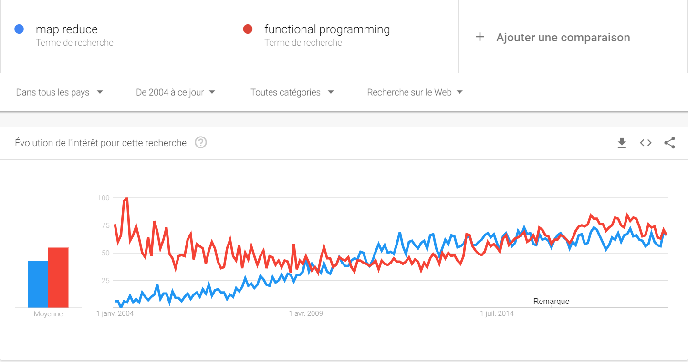

== Côté langage

=== En 2000

* La programmation objet a gagné ?

[NOTE.speaker]
--
Côté serveur, les développeurs sérieux utilisent des langages objet (Java, C++).
J'écris sérieux avec un minimum de distance :

* PHP peut utiliser des objets (mais pas trop),
* Python 2 est encore d'actualité
* Bash (utilisé pour les scripts CGI) est ... bash
--

[%notitle,background-iframe="http://www.crockford.com/javascript/javascript.html"]
=== Sauf dans le navigateur

[NOTE.speaker]
--
L'un des aspects qui a le plus déservi Javascript est évidement le fait qu'il soit fonctionnel, 
à une époque où tout le monde développe en utilisant le paradigme objet.
Et c'est ce qu'explique très bien cet article : Javascript est du Lisp déguisé en C/Java !
--

=== En 2010

[%step%]
* Java a tellement gagné qu'il est copié (merci Microsoft)
** La JVM commence à héberger d'https://vmlanguages.is-research.de/[autres langages]/d'autres paradigmes
* Javascript ... ne bouge pas (même si Chrome existe déja)

=== En 2019

[%step%]
* Tous les langages incluent un nouveau paradigme
** La https://fr.wikipedia.org/wiki/Programmation_fonctionnelle[programmation fonctionnelle] date de 1958 avec Lisp

[NOTE.speaker]
--
La première entreprise dans laquelle je travaillais (en 1999) développait des réseaux de neurones en https://fr.wikipedia.org/wiki/Scheme[Scheme] (quid ate de 1970).
Et si certains éléments se sont répandus parce qu'ils facilitent la vie du développeur,
on ne peut pas dire que la programmation fonctionnelle ait remplacé les paradigmes existants.
--

[%notitle,background-iframe="http://trends.google.com/trends/explore?date=all&q=map%20reduce,functional%20programming"]
=== Pourquoi cette vague de la programmation fonctionnelle ?

