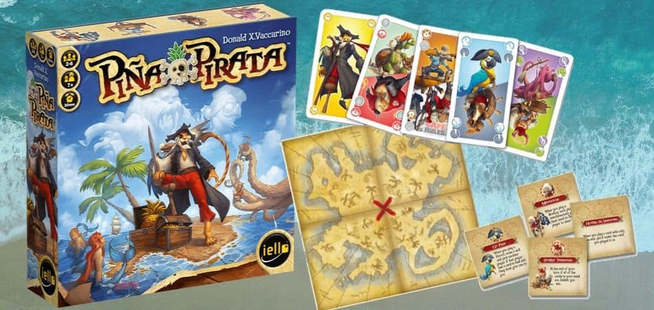
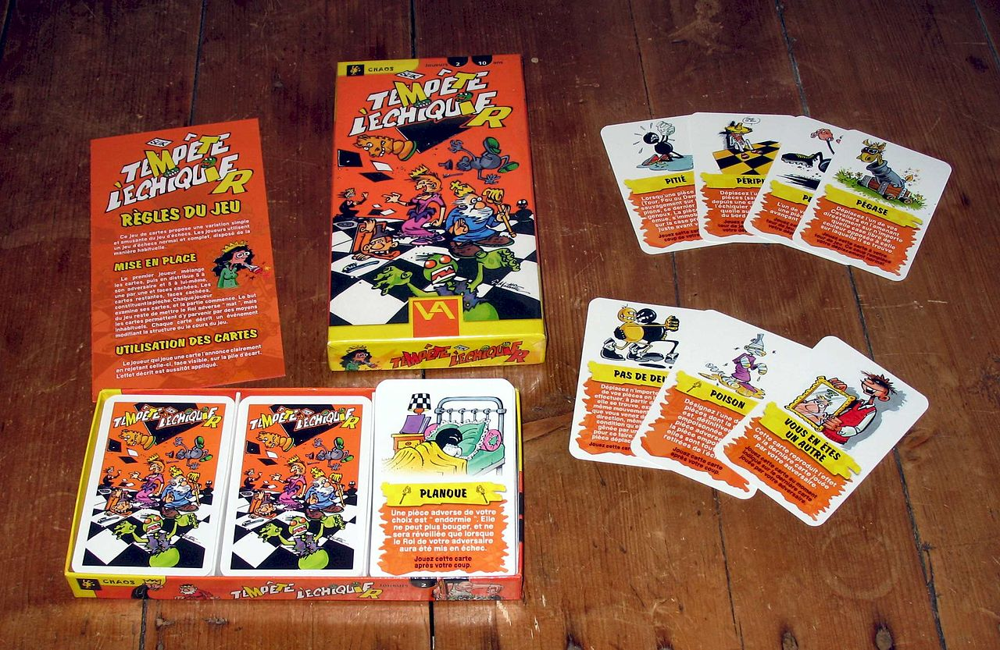

:icons: font
:revealjs_progress: true
:revealjs_previewLinks: true
:revealjs_mouseWheel: true
:revealjs_history: true
:customcss: custom.css
:source-highlighter: highlightjs

= Comment jouer avec les règles ?

[NOTE.speaker]
--
On vit dans un système plein de règles ...
Et on va essayer de voir ici où sont les pointillés qui permettent de plier le réel et de faire ce que vous voulez quand vous voulez.
Mais pour commencer, on va s'intéresser à un contexte dans lequel les règles sont essentielles, et pourtant amusantes.
--

[%notitle]
== Commençons avec un jeu simple ...

[NOTE.speaker]
--
Pile-ou-face, c'est quand même le jeu le plus simple du monde.
Et ça marche, parce que tout le monde en comprend les règles.
--

[%notitle]
=== Compliquons un poil les choses ...

[NOTE.speaker]
--
Bon, là, les règles sont un poil plus compliquées.
Mais vraiment **juste** un poil.
Et pourtant, rien que cette petite modiication suffit à faire apparaître des aspects du jeu extrêmement intéressants.
La symétrie des règles, par exemple.
Mais aussi, et surtout les aspects psychologiques.
Ceux-là sont fascinants. 
Mais ils ne sont pas le sujet de cette présentation (parlez-en aux agilistes !).
On va donc passer à autre chose.
--

[%notitle]
=== On arrive aux vrais jeux !

[NOTE.speaker]
--
Un jeu de cartes, c'est très cool, parce q'on arrive à une notion intéressante : la séparation des responsabilités !
En effet, avec un même jeu de cartes, on peut jouer à ... vraiment beaucoup de jeux

* https://fr.wikipedia.org/wiki/Manille_(jeu)[La manille]
* https://fr.wikipedia.org/wiki/Belote[La belote]
* https://fr.wikipedia.org/wiki/Cat%C3%A9gorie:Poker[Le poker]
* https://gist.github.com/Allov/c59849077535b061a1edfe490b72de92[Le dutch]
* https://fr.wikipedia.org/wiki/Cat%C3%A9gorie:Bridge[Le bridge]
* https://fr.wikipedia.org/wiki/Trou_du_cul_(jeu)[Le trouduc]

Et tant d'autres ...

Même si chacun de ces jeux est très différent, ils ont tous le même support, et ça a un impact : 
on ne peut pas changer de jeu en cours de route, pas plus qu'on ne peut appliquer de nouvelles rèles.
--

[%notitle]
=== Et si on changeait les règles ?

[NOTE.speaker]
--
Et pourtant, il y a des jeux dans lesquels on peut changer les règles ... parmi un ensemble défini par les créateurs du jeu.
C'est le cas de https://www.iello.fr/fr/fiche/pina-pirata[Piña Pirata]. C'est aussi le cas de https://fr.wikipedia.org/wiki/Democrazy[Democrazy].
Et pour ceux qui ne connaissent pas ces jeux, ça ajoute beaucoup d'incertitude dans les parties.
Ca ajoute aussi des moments où de nouveaux joueurs proposent ces nouvelles règles.
Mais ces propositions ne sont évidement pas consensuelles :
dans Democrazy, par exemple, chaque joueur va essayer de changer les règles directement à son avantage.
Et dans Piña Pirata, le joueur qui tire une nouvelle règle la choisit ... par affinité.

Mais est-ce qu'on peut aller plus loin ?
--

[%notitle]
=== Et on peut changer les règles partout !

[NOTE.speaker]
--
Bien sûr, une fois qu'on se dit qu'on peut changer les règles en cours de route, 
on peut changer facilement de support et s'attaquer au jeu des rois.

Si vous n'avez jamais joué à https://fr.wikipedia.org/wiki/Temp%C3%AAte_sur_l%27%C3%A9chiquier[Tempête sur l'échiquier], essayez, c'est vraiment une expérience.
Mais si on peut changer de support, a-t-on encore besoin de support ?
--

== Et si les règles étaient un élément du jeu ?

[NOTE.speaker]
--
On va maintenant essayer d'imaginer un jeu dans lequel les objets du jeu sont les règles elles-mêmes ... mais attention
--

[%notitle,background-iframe="https://blog.codinghorror.com/meta-is-murder/"]
=== Trigger warning : jouer avec les règles, c'est meta

[NOTE.speaker]
--
Parler de jeu où les règles sont les objets du jeu, c'est comme parler de programmation fonctionnelle, ou de méta-programmation.
Parler de ce genre de jeu, c'est évidement dangereux, et pas forcément toujours facile.
Mais c'est aussi intéressant, parce que les gens qui font ça en-dehors des jeux sont des jeux sont des gens très sérieux.
--

[%notitle]
=== Qui d'autre parle des règles régissant le jeu ?

[NOTE.speaker]
--
Si vous en avez l'occasion, la prochaine fois que vous irez à Paris, allez visiter le jardin du Palais Royal.
D'abord, c'est un très beau parc, très tranquille.
Mais c'et aussi l'un des lieux de pouvoirs cachés de la République.
Au même endroit, vous trouverez

* Le conseil constitutionnel
* Le ministère de la Culture
* Le conseil d'état
* la comédie française

En l'occurence, on va s'intéresser au conseil constitutionnel, 
dont le travail est de déterminer comment s'applique et comment peut évoluer la constitution.
Et le droit constitutionnel, cest quelque chose ! Qui a le droit de voter, quand, quelles sont les institutions, c'est complexe.
Pour expliquer tout ça, Peter Suber a créé Nomic, et on va en parler.
--

[%notitle,background-iframe="https://fr.wikipedia.org/wiki/Nomic#R%C3%A8gles_usuelles"]
=== On arrive au nomic

[NOTE.speaker]
--
Nous y voilà enfin.
Le nomic est donc un jeu où, pour gagner la partie, vous avez le choix entre

* tordre les règles pour vous nommer gagnant ou
* provoquer un paradoxe législatif qui bloque la partie

Mais si vous regardez bien l'article de la wikipedia, il manque encore beaucoup de choses :

* Comment voter ?
* Comment gagner ?
* Quand un joueur peut-il proposer une modification ?

Bref, en l'état, c'est inexploitable.
Voyons donc quelques exemples un peu plus applicables.
--

[%notitle,background-iframe="http://no-reality.org/public/jeux/Nomic.php3"]
=== Nomic

[NOTE.speaker]
--
Le point de départ standard quand on veut commencer.
Franchement, c'est indigeste.
--

[%notitle,background-iframe="http://www.jvgruat.com/Nomic/MN.htm"]
=== Mininomic

[NOTE.speaker]
--
Bon, les règles sont assez courtes, et du coup, comme dans un modèle de données vraiment minimal, 
il faut construire beaucoup de choses avant que ça ne devienne vraiment marrant.
--

[%notitle,background-iframe="https://riduidel.wordpress.com/2004/04/26/conanomic-rgles-initiales/"]
=== Conanomic

[NOTE.speaker]
--
J'étais obligé de le citer, parce que c'est mon propre jeu de règles 😉
Bon, je pourrais donner des variantes par dizaines, mais ça ne ferait pas avancer les choses.
La grande question, maintenant, c'est ce qu'on en fait ...
--

== Comment ça s'applique à notre métier ?

[NOTE.speaker]
--
Où peut-on bien trouver un ensemble de règles qui régissent l'organisation de travail et sur lesquelles on revient régulièrement ?
--

[%notitle,background-iframe="https://fr.wikipedia.org/wiki/Manifeste_agile#Quatre_valeurs[4]"]
=== Dans le manifeste agile ?

[%notitle,background-iframe="https://www.blogdumoderateur.com/retrospective-scrum-idees-outils-conseils-ceremonie/"]
=== Ou dans les cérémonies découlant de son application ?

[NOTE.speaker]
--
Parce que si il y a bien un moment où on joue avec les règles de l'agilité, c'est pendant la rétrospective.
Lors de celle-ci, l'équipe va proposer des évolutions de la méthode.
Mais dans cette évolution, il y a clairement des aspects qui se rapprochent du nomic :

* Certains éléments sont immuables : la composition de l'équipe, parfois la durée des itérations, l'objectif de l'équipe.
* Les règles de vote sont censées être claires ... mais le sont-elles ?
* Il y a une bonne partie d'éléments consensuels non explicites (la qualité, ça compte, il faut travailler en équipe, ...)
--

=== Que faire ?

* Clarifier les règles du jeu
** Quelles sont les procédures de vote
* Clarifier les éléments mutables du développement
** Est-ce qu'on peut changer la durée des sprints ?
** Est-ce qu'on peut réorganiser l'équipe ?
** Est-ce qu'il faut aller aussi vite ?

== Merci !

image::https://media.giphy.com/media/1sMH6m5alWauk/giphy.gif[width=200%]