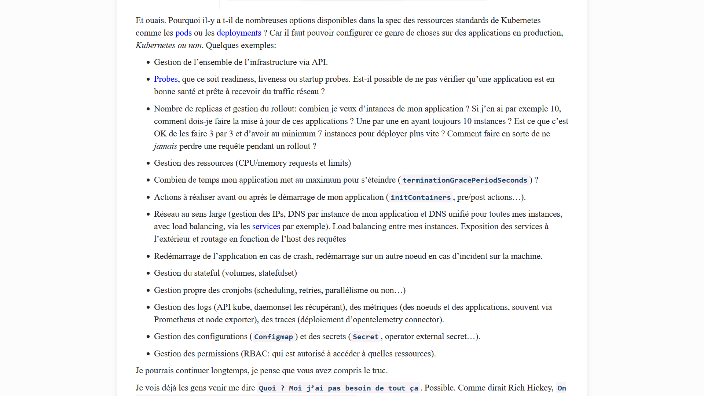
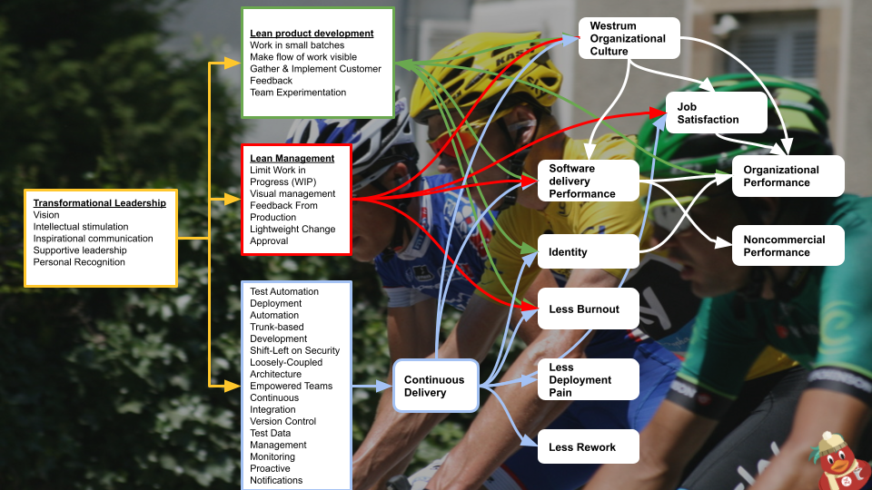

:icons: font
:revealjs_progress: true
:revealjs_previewLinks: true
:revealjs_mouseWheel: true
:revealjs_history: true
:revealjs_preloadIframes: true
:revealjs_plugin_notes: enabled
:customcss: custom.css
:source-highlighter: highlightjs

[%notitle]
= Pourquoi vos utilisateurs ont besoin de K8s

:sectnums!:

[NOTE.speaker]
--
Je vous préviens, ce titre est un mensonge. On ne va pas parler tout de suite de K8s, mais plus des facteurs qui mènent à l'adoption de ce genre de technologie.
--

////
[%notitle]
== Qui suis-je ?

Nicolas Delsaux / @riduidel on https://framapiaf.org/users/riduidel[🐘] / https://twitter.com/riduidel[icon:twitter[]] / https://github.com/riduidel[icon:github[]] / https://stackexchange.com/users/8620[icon:stack-overflow[]]

Développeur Java depuis l'an 2000

Architecte de solutions/systèmes depuis 2015

image::images/zenika.png[height=100]

[NOTE.speaker]
--
--
////

[%notitle,background-iframe="https://agilemanifesto.org/iso/fr/manifesto.html"]
== Que veulent les utilisateurs ?

[NOTE.speaker]
--
Dans l'Agile Manifesto, l'une des premières choses qu'on remarque, c'est des logiciels opérationnels plutôt qu'une documentation exhaustive.
Bon, malgré tout, ça n'est qu'un slogan publicitaire, donc ça veut dire quoi au des logiciels opérationnels ?
--

== Ca veut dire quoi opérationnel ?

[NOTE.speaker]
--
Et en fait plus plus que de parler de kubernetes, ce dont on va parler aujourd'hui, c'est ça, ça veut dire quoi opérationnel ?
Avant tout, il faut se souvenir pour qui on fait les logiciels ?
On les fait pour des utilisateurs, pas vrai ?
Alors ils veulent quoi les utilisateurs ?
--

=== Et si je demandais à une utilisatrice ?

[%step]
* Ca marche
** Je n'attends pas après avoir cliqué
* J'ai confiance
* C'est facile à utiliser

[NOTE.speaker]
--
J'ai la chance, comme la plupart d'entre vous, de disposer à domicile d'une utilisatrice en résidence.
Quelqu'un qui ne sait pas ce qu'est le développement. 
Et si je demande à cette utilisatrice ce que ça veut dire un logiciel opérationnel, j'obtiens ses réponses.

*Afficher les étape*

--

=== C'est pas vraiment ce qu'on fait ...

[options="header",frame=none, grid=rows]
|=================================================
| Pour l'utilisateur      | Pour l'organisation
| Ca marche               | L'application est fiable
| Je n'attends pas        | L'application est performante
| J'ai confiance          | L'application est sûre
| C'est facile à utiliser | L'application est ergonomique
|=================================================

[NOTE.speaker]
--
Si on essaie de mettre des mots un peu professionnels sur ce que vient de nous dire notre utilisatrice.
Voilà à peu près ce sur quoi on va tomber.

On va parler de fiabilité, de performance, de sûreté, et d'ergonomie.

**Première leçon** la performance est un sous-ensemble de la fiabilité.
--

=== Et tout ça porte un nom

Les non-functionnal requirements ! 🤮

[NOTE.speaker]
--
J'imagine que maintenant vous me voyez un peu plus arriver ...
À la question à laquelle je vous propose aujourd'hui une réponse, c'est ...
En quoi est-ce que ces prérequis non fonctionnels sont en fait fonctionnels.
--

[%notitle,background-iframe="https://fr.wikipedia.org/wiki/Qualit%C3%A9_logicielle?useskin=vector#Indicateurs_de_qualit%C3%A9_logicielle"]
=== Mais c'est aussi

////
[%notitle,background-iframe="https://duckduckgo.com/?q=cassoulet+lidl&t=ffab&atb=v365-1&iar=images&iax=images&ia=images"]
=== Moment métaphorique

[NOTE.speaker]
--
Si je demande des images de cassoulet, j'aurais des résultats identiques "fonctionnellement" (des cassoulets)
, mais différents en termes de qualité perçue.
E informatique, c'est pareil : les attriuts de qualité influent tout autant sur le résultat.
Et c'est ce qu'on va voir maintenant.
--
////

[%notitle, background-iframe="https://fr.wikipedia.org/wiki/Fiabilit%C3%A9?useskin=vector"]
== Un logiciel fiable ?

=== La fiabilité est multidimensionnelle

[%step]
* Le logiciel fonctionne
** De façon performante
* Le logiciel ne présente pas de bugs

=== Il se passe quoi quand ça ne fonctionne pas ?

image::https://techchannel.com/getattachment/80347e5c-c8eb-422f-a911-3c289c92eb5d/Screen-Shot-2021-09-22-at-12-09-29-PM.png[]

Tiré de https://techchannel.com/IT-Strategy/09/2021/cost-enterprise-downtime[The Cost of Enterprise Downtime  - TechChannel - 2021]

[%notitle, background-iframe="https://en.wikipedia.org/wiki/High_availability?useskin=vector#Percentage_calculation"]
=== L'académie des 9

[NOTE.speaker]
--

En informatique, on aime mesurer l'uptime avec ces histoires de 99,9%.
Mais ça veut dire quoi en vrai ?
En vrai, ça veut dire qu'on diminue notoirement le temps disponible pour intervenir sur les machines en les arrêtant.
Regardez le temps d'un disponibilité dont vous disposez à 90%.
Regardez maintenant le temps dont vous disposez simplement en passant à 99%.
Ça va forcément vous pousser beaucoup plus d'efforts pour mettre à jour votre application ou votre serveur.
Et potentiellement, ça va vous pousser à utiliser différentes techniques:

* L'observabilité
* Une architecture plus évolutive
* De la réplication de données
* Du Clustering.

Chacune de ces techniques a un coût en temps et en argent, évidemment.
Mon heuristique est de considérer qu'à chaque fois qu'on rajoute un œuf à la fin.On multiplie par 10 le coût de développement et d'exploitation de la solution.C'est faux.Comme toutes les heuristiques, mais c'est utile.
--

[%notitle, background-iframe="https://resilien.fr/blog/comment-r%C3%A9silien-souhaite-encourager-la-sobri%C3%A9t%C3%A9-num%C3%A9rique/#pas-de-haute-disponibilit%C3%A9-par-d%C3%A9faut"]
=== La haute disponibilité, ça n'est pas non plus très green

[%notitle, background-iframe="https://www.totalbug.com/decathlon/"]
=== Ca scale ?

[NOTE.speaker]
--
Et ce qui est encore plus vicieux avec ces histoires de haute disponibilité, c'est que elles sont impactées par la scalabilité.
C'est à dire que selon les hypothèses que vous avez faites concernant la charge de votre service, vous allez provisionner un certain nombre de machines. 
Et si cette hypothèse de charge est invalide, vos machines ne seront pas forcément suffisantes et là ce sera le drame.
Et ce drame n'est pas lié au fait que vous envisagiez de la disponibilité à 99% ou à 60%. Il est simplement lié au fait que vous avez trop de clients.
Exprès de prendre ici un exemple pour qu'on connaît assez bien :
Le site de e-commerce de Décathlon s'est retrouvé down simplement parce que des utilisateurs voulaient acheter un jogging bien précis.
--

[%notitle, background-iframe="https://www.totalbug.com/decathlon/#comment-1021350"]
=== Et la fiabilité,, ce sont aussi les bugs

[NOTE.speaker]
--
Je parais tout à l'heure d'une fiabilité multidimensionnelle. 
En voilà un exemple parmi tant d'autres.
Ici, une fonctionnalité promise par le fournisseur n'est pas disponible. 
--

[%notitle, background-iframe="https://www.fabianzeindl.com/posts/the-codequality-pyramid#the-pyramid"]
=== Comment avoir un logicil fiable ?

[%notitle, background-iframe="https://fr.wikipedia.org/wiki/S%C3%A9curit%C3%A9_de_l%27information?useskin=vector#Crit%C3%A8res_de_sensibilit%C3%A9"]
== Un logiciel sûr ?

[%notitle, background-iframe="https://www.ibm.com/fr-fr/topics/network-security#Types+de+s%C3%A9curit%C3%A9+de+r%C3%A9seau"]
=== Des échanges sécurisés

[%notitle, background-iframe="https://www.ibm.com/topics/data-security#Types+of+data+security"]
=== Des données protégées

[%notitle, background-iframe="https://www.pnas.org/doi/10.1073/pnas.1618211113"]
=== Des traitements sûrs

[%notitle, background-iframe="https://carrieres.pwc.fr/fr/des-metiers-captivants/pole-digital-et-techno/comprendre-le-metier-de-consultant-ux.html"]
== Un logiciel facile à utiliser

== Que faire ?

[%notitle, background-iframe="https://web.archive.org/web/20210625103636/https://structurizr.com/help/documentation/quality-attributes"]
=== Au démarrage du projet

=== En cours de route

[%step]
* **D**efinition **o**f **r**eady
** Dans quelle mesure la fonctionnalité risque d'impacter ces attributs techniques ?
* **D**efinition **o**f **d**one
** Mesurer si ces attributs techniques ont été atteints

[%notitle]
=== Mais pourquoi K8s ?

[NOTE.speaker]
--
Voir le super article https://web.archive.org/web/20230528164936/https://www.mcorbin.fr/posts/2023-05-28-kubernetes-gueule/
--

== Conclusion

[%notitle]
=== Ca fait beaucoup penser à Accelerate, non ?

[NOTE.speaker]
--
Voir le super article https://coach-agile.com/2021/01/decouvrez-accelerate-devops/
--

== Merci !

image::https://media.giphy.com/media/1sMH6m5alWauk/giphy.gif[width=200%]

=== Références

* https://web.archive.org/web/20210625103636/https://structurizr.com/help/documentation/quality-attributes[Quality attributes]
* https://techchannel.com/IT-Strategy/09/2021/cost-enterprise-downtime[The Cost of Enterprise Downtime  - TechChannel - 2021]
* https://www.fabianzeindl.com/posts/the-codequality-pyramid[The code quality pyramid]
* https://totalbug.com[]
* https://www.mcorbin.fr/posts/2023-05-28-kubernetes-gueule/[Kubernetes vous met dans la gueule tout ce que vous ne gérez pas (ou mal) en production]