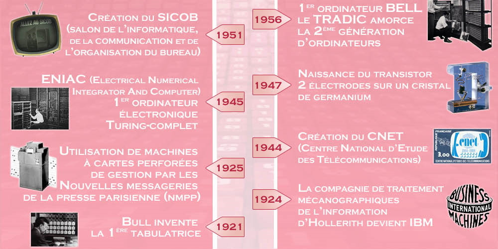
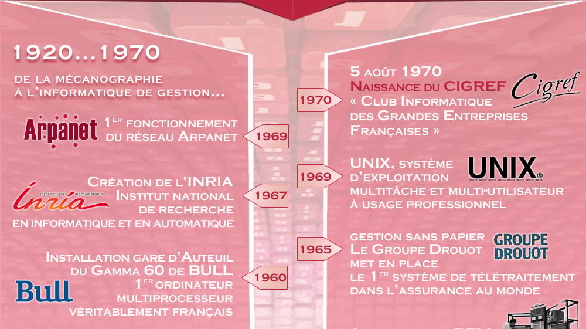

:icons: font
:revealjs_progress: true
:revealjs_previewLinks: true
:revealjs_mouseWheel: true
:revealjs_history: true
////
:revealjs_plugins: {slidesdir}/plugins.js
:revealjs_plugins_configuration: {slidesdir}/configs.js
////
:customcss: custom.css
:source-highlighter: highlightjs

= La structure du marché informatique en France

== Pourquoi ?

[NOTE.speaker]
--
Pourquoi se lancer dans une résentation aussi casse-gueule : je ne suis ni économiste, ni commercial. Alors ?
Il m'a fallu 20 ans pour commencer à comprendre pourquoi, quand on veut bosser dans l'informatique, les ESN sont inévitables.
Et l'objectif de cette présentation, c'est d'essayer de vous apporter un éclairage sur ce sujet.
--

== Un peu d'histoire

[%notitle, background-iframe="https://fr.wikipedia.org/wiki/Histoire_de_l%27informatique#L'%C3%A9volution_des_pratiques_techniques_et_sociales"]
=== Un peu d'histoire - la vision Wikipedia

[%notitle]
=== Un peu d'histoire - la vision du CIGREF - partie 1

[NOTE.speaker]
--
Cette image vient tout droit du site du CIGREF, https://www.cigref.fr/organisations-membres-du-cigref[un club d'entreprises utilisatrices de l'informatique]. Et elle donne une vision orientée de l'histoire de l'informatique en France.
--

[%notitle]
=== Un peu d'histoire - la vision du CIGREF - partie 2

[NOTE.speaker]
--
Cette image vient tout droit du site du CIGREF, https://www.cigref.fr/organisations-membres-du-cigref[un club d'entreprises utilisatrices de l'informatique]. Et elle donne une vision orientée de l'histoire de l'informatique en France.
--

[%notitle, background-iframe="https://www.unilim.fr/interfaces-numeriques/2546#article_toc"]
=== Un peu d'histoire - pour aller plus loin

== Quelques chiffres

[vegalite, my-diagram, svg]
....
{
"$schema": "https://vega.github.io/schema/vega-lite/v3.json",
"width": 500,
"data": {
"values": [
{"Customer": "Customer1", "Bandwidth": 250},
{"Customer": "Customer2", "Bandwidth": 50}
]
},
"mark": "bar",
"encoding": {
"color": {"field": "Customer", "type": "nominal"},
"x": {
"field": "Bandwidth",
"scale": {"domain": [0, 500]},
"type": "quantitative",
"axis": {"title": "Circuit Bandwidth Guarantee (Mbps)"}
}
}
}
....

== TODO

* https://www.insee.fr/fr/statistiques/3628299
* https://www.toute-la-franchise.com/vie-de-la-franchise-A31971-marche-informatique.html
* http://www.analyse-sectorielle.fr/secteurs-2/secteur-des-services-informatiques/ moins bon

== Merci !

image::https://media.giphy.com/media/1sMH6m5alWauk/giphy.gif[width=200%]