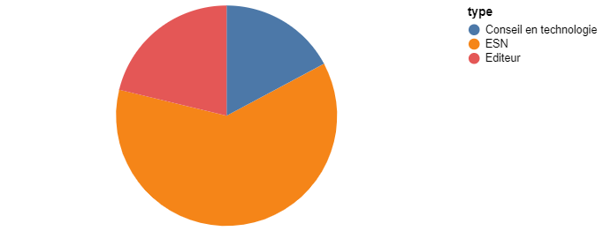

:icons: font
:revealjs_progress: true
:revealjs_previewLinks: true
:revealjs_mouseWheel: true
:revealjs_history: true
////
:revealjs_plugins: {slidesdir}/plugins.js
:revealjs_plugins_configuration: {slidesdir}/configs.js
////
:customcss: custom.css
:source-highlighter: highlightjs

= La structure du marché informatique en France

== Pourquoi ?

[NOTE.speaker]
--
Pourquoi se lancer dans une résentation aussi casse-gueule : je ne suis ni économiste, ni commercial. Alors ?
Il m'a fallu 20 ans pour commencer à comprendre pourquoi, quand on veut bosser dans l'informatique, les ESN sont inévitables.
Et l'objectif de cette présentation, c'est d'essayer de vous apporter un éclairage sur ce sujet.
--

[%notitle, background-iframe="https://1000-idees-de-culture-generale.fr/sapiens-breve-histoire-humanite/#elementor-toc__heading-anchor-2"]
== Mais c'est quoi une entreprise ?

== Un peu d'histoire

[%notitle, background-iframe="https://fr.wikipedia.org/wiki/Histoire_de_l%27informatique#L'%C3%A9volution_des_pratiques_techniques_et_sociales"]
=== Un peu d'histoire - la vision Wikipedia

[%notitle]
=== Un peu d'histoire - la vision du CIGREF - partie 1

image::images/CIGREF-infographie-histoire-informatique-entreprises-partie-2.jpg[]

[NOTE.speaker]
--
Cette image vient tout droit du site du CIGREF, https://www.cigref.fr/organisations-membres-du-cigref[un club d'entreprises utilisatrices de l'informatique]. Et elle donne une vision orientée de l'histoire de l'informatique en France.
--

[%notitle]
=== Un peu d'histoire - la vision du CIGREF - partie 2

image::images/CIGREF-infographie-histoire-informatique-entreprises-partie-1.jpg[]

[NOTE.speaker]
--
Cette image vient tout droit du site du CIGREF, https://www.cigref.fr/organisations-membres-du-cigref[un club d'entreprises utilisatrices de l'informatique]. Et elle donne une vision orientée de l'histoire de l'informatique en France.
--

[%notitle, background-iframe="https://www.museeinformatique.fr/comment-sest-elle-developpe-linformatique-en-france/"]
=== Un peu d'histoire - Une vision muséographique

[%notitle, background-iframe="http://www.lexweb.fr/la-petite-histoire-linformatique-france/"]
=== Un peu d'histoire - Un autre axe économique

////
[%notitle, background-iframe="https://www.unilim.fr/interfaces-numeriques/2546#article_toc"]
=== Un peu d'histoire - pour aller plus loin
////

=== Il manque

* la révolution de l'informatique personnelle des années 80
* Le bug de l'an 2000
* La première bulle internet
* La transformation numérique

=== Conclusion provisoire

1. Le métier d'une ESN est sa capacité à flexibiliser les coûts informatiques du client
1. L'informatique est encore vue comme un coût

== Quelques chiffres

=== Répartition du CA par type d'entreprise SYNTEC

////
[vegalite, ca-percentage, png]
....
{
    "$schema": "https://vega.github.io/schema/vega-lite/v5.json",
    "width":400,
    "data": {
        "values": [
            {"type": "ESN", "percent": 61},
            {"type": "Editeur", "percent": 21},
            {"type": "Conseil en technologie", "percent": 17}
        ]
    },
    "mark": "arc",
    "encoding": {
        "theta": {"field": "percent", "type": "quantitative"},
        "color": {"field": "type", "type": "nominal"}
    },
    "view": {"stroke": null}
}   
....
////

[NOTE.speaker]
--
Les chiffres proviennent de https://www.zdnet.fr/actualites/chiffres-cles-les-services-it-et-l-edition-logicielle-en-france-39790401.htm[ZDNet] et du SYNTEC.
--

=== "Palmarès" des plus grosses entreprises

[source,javascript]
----
{"nom":"CAPGEMINI TECHNOLOGY SERVICES", "ca":"2 507 872 000", "cp": "92130", "ville":"ISSY LES MOULINEAUX", "type":"ESN"},
{"nom":"MICROSOFT FRANCE", "ca":"2 164 787 899","cp":"92130", "ville":"ISSY LES MOULINEAUX", "type":"Editeur"},
{"nom":"CIE IBM FRANCE", "ca":"2 068 000 000", "cp":"92270", "ville":"Bois-Colombes", "type":"ESN"},
{"nom":"SOPRA STERIA GROUP", "ca":"1 512 781 000", "cp":"74940", "ville":"ANNECY", "type":"ESN"},
{"nom":"ACCENTURE", "ca":"1 437 550 972", "cp":"75013", "ville":"PARIS 13", "type":"ESN"},
{"nom":"EURO-INFORMATION EUROPEENNE DE TRAITEMENT DE L'INFORMATION", "ca":"1 359 404 813", "cp":"67000","ville": "STRASBOURG", "type":"Client final"},
{"nom":"CGI FRANCE", "ca":"1 128 722 208", "cp":"92400", "ville":"COURBEVOIE","type": "ESN"},
{"nom":"SAP FRANCE", "ca":"1 069 345 661", "cp":"92300", "ville":"LEVALLOIS PERRET", "type":"Editeur"},
{"nom":"CREDIT AGRICOLE-GROUP INFRASTRUCTURE PLATFORM", "ca":"1 017 971 580", "cp":"75015", "ville":"PARIS 15", "type":"Client final"},
{"nom":"AMADEUS", "ca":"992 798 000", "cp":"6410", "ville":"BIOT", "type":"Editeur"},
----

[NOTE.speaker]
----
Les chiffres proviennent de https://www.verif.com/Hit-parade/01-CA/03-Par-activite/62-Programmation-conseil-et-autres-activites-informatiques#verif_meslistes_thead[BFM Verif]
----

=== Zenika & co

[source,javascript]
----
{"nom":"OCTO-TECHNOLOGY", "ca":"103 357 450", "cp":"75002", "ville":"PARIS 2", "type":"ESN"},
{"nom":"SFEIR", "ca":"46 250 149", "cp":"92200","ville": "NEUILLY SUR SEINE", "type":"ESN"},
{"nom":"VIADEO", "ca":"23 941 451", "cp":"75009", "ville":"PARIS 9", "type":"Startup"},
{"nom":"FDJ GAMING SOLUTIONS FRANCE", "ca":"22 930 000", "cp":"92100", "ville":"BOULOGNE BILLANCOURT", "type":"Editeur"},
{"nom":"ZENIKA", "ca":"21 923 586", "cp":"75009", "ville":"PARIS 09", "type":"ESN"},
{"nom":"ELASTICSEARCH SARL", "ca":"21 355 820", "cp":"75005", "ville":"PARIS 05", "type":"Editeur"},
{"nom":"INEAT LILLE", "ca":"14 544 434", "cp":"92100", "ville":"BOULOGNE BILLANCOURT", "type":"ESN"}
----

== Conclusion

* Ne parlez pas d'ESN mais de cabinet de conseil
* Comprenez où vous mettez les pieds

== TODO

* https://www.insee.fr/fr/statistiques/3628299
* https://www.toute-la-franchise.com/vie-de-la-franchise-A31971-marche-informatique.html
* http://www.analyse-sectorielle.fr/secteurs-2/secteur-des-services-informatiques/ moins bon

== Merci !

image::https://media.giphy.com/media/1sMH6m5alWauk/giphy.gif[width=200%]